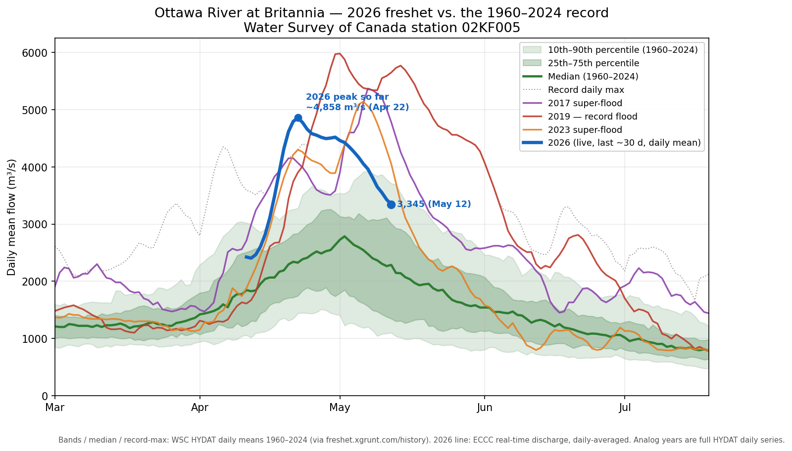

# Companion brief — how big *is* the 2026 freshet? A better chart than "current vs median"

*Community note, 2026-05-12. Suitable for sharing in the Northern
Reservoirs / Ottawa River / Tourism / Wildlife / Flood Watch group's
Files section. All numbers reproducible from public Water Survey of
Canada and ECCC data — script and sources at the bottom. Companion to the daily-brief series
in `freshet-public/data/daily-briefs/`.*

---

## The chart going around

A "Ottawa River Flow — Current vs Median" bar chart has been
circulating: seven main-stem stations, a red bar for today's flow and
a green bar for the 30-year median, with a caption that the system is
in a high-flow freshet regime and that "based on total volume… this
event ranks among the top five highest freshet flows ever recorded on
the Ottawa River."

The river really *is* running well above median at every station —
that part is solid, and it lines up with the ORRPB's own forecast
language. But a current-vs-median bar chart is a weak way to show *how
big* a freshet is, for three reasons:

1. **It's a single snapshot, and it's past the peak.** The bar chart
   was drawn on May 11. The 2026 crest was three weeks earlier
   (April 19–22). Quoting a May-11 number — Carillon ≈ 5,300 m³/s — as
   if it were "the event" understates it: the actual April crest at
   Carillon was roughly 7,700 m³/s. A snapshot can't tell you where
   the peak landed.
2. **A median has no spread.** "65 % above median" sounds dramatic,
   but without the percentile range you can't tell whether that's a
   1-in-3-year occurrence or a 1-in-30-year one. You need the
   distribution, not just its middle.
3. **At the regulated stations the "ratio" is partly a policy
   artifact.** Témiscaming outflow is whatever the ORRPB sets it to —
   it's been held at 2,500+ m³/s on purpose this spring. Its
   2,538-vs-920 "ratio" reflects a release decision as much as a
   natural-flow anomaly.

## A better view: the spring hydrograph against the climatology

This is the Ottawa River at **Britannia** (Lac Deschênes, WSC station
02KF005) — the longest continuous *flow* record in the basin, and the
station the case file already uses as its index. (Daily Carillon flow
isn't public after 1994, which is why Britannia, not the basin
terminal, is the right gauge for a long-record comparison.)

- **Green bands** — the 10th–90th and 25th–75th percentiles of daily
  mean flow on each calendar day, 1960–2024. This is the "normal
  range" the bar chart's single green bar is trying to stand in for.
- **Dark green line** — the long-term median (the bar chart's green
  bar, but for every day of the season instead of one).
- **Dotted grey** — the record daily maximum for each day.
- **Thin coloured lines** — the three modern super-flood years: 2019
  (the record), 2017, 2023.
- **Bold blue** — 2026, live, from ECCC's real-time discharge feed,
  averaged to daily values.

## Where 2026 actually lands

Read off the chart and the numbers behind it:

| | Daily mean flow at Britannia | Where it sits |
|---|---:|---|
| 2026 crest (≈ Apr 22) | ~4,860 m³/s | Above the record line for that date; ~**5th-highest spring peak** in the 1960–2024 flow record |
| 2026 now (May 12) | ~3,350 m³/s | ≈ **80th percentile** for the date — clearly elevated, but well inside the historical range |
| 2019 (record) | 5,980 m³/s | |
| 2017 | 5,370 m³/s | |
| 2023 | 5,140 m³/s | |
| 1979 | 5,060 m³/s | |
| **2026** | **~4,860 m³/s** | **← here** |
| 1974 | 4,450 m³/s | |

So the caption's "top five" framing is **roughly right — but for the
peak, not for today's number, and at Britannia rather than "the Ottawa
River" generically.** 2026's April crest slots in just below 1979 and
just above 1974 — fifth in the 65-year Britannia flow record, in the
company of 2019/2017/2023 but a clear step below 2019. By the time you
get to the basin terminal at Carillon — where 2026 crested near
7,700 m³/s but 2019 ran higher still (~9,000 m³/s, scaling from the
Britannia ratio) — 2026 ranks lower. And "ever recorded on the
Ottawa River" is a stretch: the continuous *flow* record at Britannia
begins in 1960 (level records go back further, but those aren't flow).

The honest one-liner: **2026 was a high-end freshet — a top-five spring
peak at Britannia and the 4th-highest crest in the modern record at Lac
Coulonge — now receding through an elevated-but-ordinary tail.** That's
a stronger and more defensible statement than anything a May-11
current-vs-median bar can support, and the hydrograph shows the whole
shape of it at once.

## Caveats

- **The blue line starts April 11, not March 1.** ECCC's real-time
  feed only retains about 30 days; the finalized HYDAT daily means for
  2026 aren't published yet. The window does cover the April crest and
  the recession — the part that matters — just not the rising limb.
  Easy to backfill and redraw once HYDAT updates.
- **Daily mean, not instantaneous.** The instantaneous peak would be a
  little higher than ~4,860 m³/s; rankings on an instantaneous basis
  could shuffle slightly.
- **Britannia ≠ your gauge.** This is the basin index station, not Lac
  Coulonge or any single property's reference. For property-impact
  thresholds see the daily briefs and the dashboard at
  `freshet.xgrunt.com`.

## Sources and reproducibility

- **Britannia daily flow** (WSC station 02KF005): Water Survey of
  Canada HYDAT, Open Government Licence —
  [collaboration.cmc.ec.gc.ca](https://collaboration.cmc.ec.gc.ca/cmc/hydrometrics/www/).
  Pulled here via the cluster's read-only PostgREST proxy at
  `freshet.xgrunt.com/history/wsc_daily` (the same series the other
  climate-history scripts cross-check against — agrees with HYDAT to
  ~1 m³/s).
- **2026 daily curve**: Environment and Climate Change Canada
  real-time hydrometric service, OGC API collection
  `hydrometric-realtime` at
  [api.weather.gc.ca](https://api.weather.gc.ca/), station 02KF005,
  5-minute discharge averaged to daily.
- **Reproduction script**:
  `ingesters/climate-history/britannia_freshet_hydrograph.py`. Stdlib
  + numpy + matplotlib, no local files, no auth — fetches both sources
  live and writes `data/community-notes/2026-05-12_britannia_hydrograph.png`.
- **Context for "top five" / ranking claims**:
  [`docs/analysis/Freshet_2026_Complete_Summary.md`](https://github.com/aachtenberg/ottawa-river-freshet/blob/main/docs/analysis/Freshet_2026_Complete_Summary.md)
  — Historical Peak Comparison (Lac Coulonge crest = 4th in the modern
  record) and Test C (basin-wide annual volume ≈ +17 % post-2017).
- **Why May is the load-bearing month**:
  [`data/community-notes/2026-05-07_freshet_shape_brief.md`](2026-05-07_freshet_shape_brief.md).

This brief was compiled in response to a circulating community graphic.
The data is public, the script is public, the case file is public —
corrections welcome.
