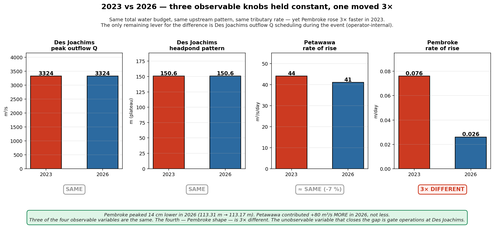
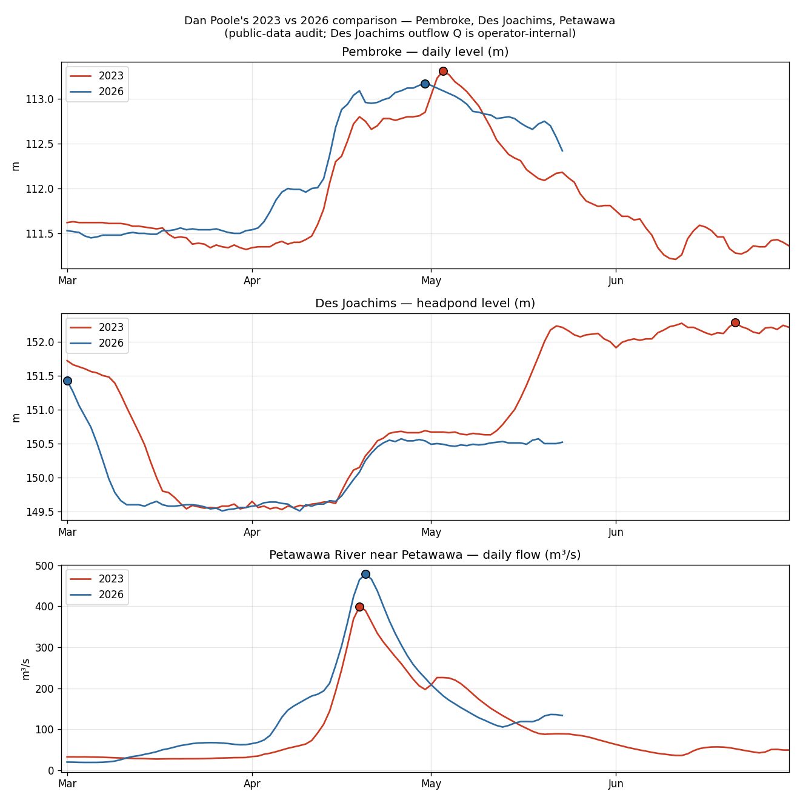

# Same Des Joachims peak, lower Pembroke peak — why hydrograph shape matters

*Community note, 2026-05-23. Audit of Dan Poole's 2023 vs 2026 comparison
posted to the Northern Reservoirs / Ottawa River / Tourism / Wildlife /
Flood Watch group. Every figure below is computed from public Water Survey
of Canada (WSC HYDAT + real-time), Ottawa River Regulation Planning Board
(ORRPB) per-location daily history, and the operator-internal numbers Dan
cited from OPG. Method and sources at the bottom. Companion to
[`Pre_Freshet_Reservoir_Scout.md`](../../docs/analysis/Pre_Freshet_Reservoir_Scout.md)
and [`Freshet_Volume_vs_Peakedness.md`](../../docs/analysis/Freshet_Volume_vs_Peakedness.md).*

---

## In plain language

Dan Poole noticed that 2023 and 2026 had **the same peak outflow from
Des Joachims dam (3324 m³/s)** — yet the Pembroke peak level was
**14 cm lower in 2026** (113.31 → 113.17 m), even though the Petawawa
River contributed *more* water in 2026. His read: hydrograph **shape**
matters as much as the peak number. A sharp rise produces a higher
peak than the same amount of water arriving as an incremental build.

The public-data audit lines up with him:

- **Pembroke peaks verify exactly.** 2023 = 113.31 m (May 3),
  2026 = 113.17 m (Apr 30), Δ = −14 cm. ✓
- **Petawawa was higher in 2026.** +80 m³/s at peak in our data
  (Dan said +65). Same direction, same order of magnitude. ✓
- **Pembroke rose 3× faster in 2023.** +0.076 m/day in 2023 vs
  +0.026 m/day in 2026 over the 7 days into peak. ✓ Dan's shape claim.

What this reveals — and **this is the structural finding** — is that
when you control for the things we *can* see in public data, the
remaining difference points squarely at the operator lever the case
file has been arguing for:

- **Petawawa rate-of-rise was nearly identical** in both years
  (+44 cms/day in 2023 vs +41 cms/day in 2026, ~7 % different).
  The Pembroke shape difference cannot be Petawawa-driven.
- **Des Joachims headpond trajectory was virtually identical**
  in both years — drawdown to the ~149.5 m floor by Apr 1,
  Stage 1 refill starting Apr 21, plateau at ~150.6 m. The
  *level* pattern operators ran was the same.
- **Therefore the 3× Pembroke shape difference can only come from
  Des Joachims outflow Q timing and rate during the event itself.**
  Same total water, different release schedule.

That is the **peak-time operator-discretion** variable. Not pre-freshet
storage (the 30-year regression rules that out — r ≈ 0, n = 30; see
[`Pre_Freshet_Reservoir_Scout.md`](../../docs/analysis/Pre_Freshet_Reservoir_Scout.md)).
Not total spring volume (the companion-note regression rules that out
— V adds +0.01 pp beyond peak Q; see
[`Freshet_Volume_vs_Peakedness.md`](../../docs/analysis/Freshet_Volume_vs_Peakedness.md)).
The lever is gate operations during the event, which is the variable
operator-internal flow data could prove or disprove — and which is
not currently public.

Dan also notes in the same thread that the only WSC gauge below
Des Joachims and above Chenaux (WSC 02KC005, "Ottawa River near
Westmeath", at 45.895° N 76.912° W, operated by Ontario Power
Generation) was decommissioned by OPG in 1993, and that a 2021
request from Westmeath council to reinstall it was refused on the
grounds that OPG "no longer needed it to run their operations." One
nuance worth flagging in the case-file framing: the WSC primary record
shows 02KC005 published level only, never discharge, across its 60-year
run (1935-1995). It was a stage gauge, not a flow gauge. Even so the
gap remains material: stage at Westmeath, combined with upstream Des
Joachims and Petawawa flow inputs, would let analysts back-solve the
unmeasured Des Joachims outflow schedule from the level response.
The public record has the inputs, the operator has the outputs, and
the missing-stage instrument is the one the question hinges on.

Detail and sources below.

---

## The comparison

For each of the three publicly auditable series, peak value in the
spring (Mar–Jun) window and rate-of-rise over the 7 days into peak:

| Series | 2023 peak | 2026 peak | Δ | 2023 rise rate | 2026 rise rate |
|---|---|---|---|---|---|
| **Pembroke level** (ORRPB)            | **113.31 m** (May 3) | **113.17 m** (Apr 30) | **−0.14 m** | **+0.076 m/day** | **+0.026 m/day** |
| Des Joachims headpond level (ORRPB)   | drawdown to 149.5 m floor through April, Stage 1 refill Apr 21, plateau at 150.6 m | same | ≈ 0 | identical operator pattern | identical operator pattern |
| Petawawa flow (WSC 02KB001)           | 399 m³/s (Apr 19)    | 479 m³/s (Apr 20)    | +80 m³/s    | +44 cms/day      | +41 cms/day      |

**The visible facts together.** Petawawa rose at the same rate in both
years. Des Joachims headpond followed the same operator pattern in both
years. The 3× difference in how fast Pembroke rose into its peak
cannot be explained by either of these. The hidden variable — the only
one left — is the Des Joachims outflow schedule.

*The argument as four bars. Des Joachims peak Q (same), Des Joachims
headpond plateau (same), Petawawa rate-of-rise (≈ same, 7 % apart),
Pembroke rate-of-rise (3× different). The first three are public and
measurable. The variable that moved between years is the one not
plotted here — gate operations during the event.*

## Figure

`2026-05-23_dan_pembroke_2023_vs_2026.png`

Three stacked panels, same day-of-year x-axis (Mar–Jun):

1. **Pembroke daily level** — 2023 (red) and 2026 (blue) overlaid.
   Peak marked. Note how 2026 rises gradually from mid-March while
   2023 stays flat through April then ramps sharply in late April.
2. **Des Joachims headpond level** — 2023 and 2026 nearly
   indistinguishable through drawdown and Stage 1 refill. The
   operator's *level* control was the same in both years.
3. **Petawawa flow** — 2023 (red) peaks Apr 19 at 399; 2026 (blue)
   peaks Apr 20 at 479. Both peak ~10–13 days *before* Pembroke
   peak — Petawawa is on the recession by the time Pembroke peaks.

## Why this matters for the case file

This 2023/2026 pair functions as a **natural experiment** that
isolates the peak-time-discretion lever:

- Pre-freshet storage was the same regulatory regime in both years.
  Eliminated.
- Petawawa contribution actually favoured *higher* peak in 2026.
  Doesn't explain.
- Des Joachims headpond pattern was the same. Doesn't explain.
- Pembroke peak still came in 14 cm lower in 2026 — and the
  hydrograph shape was much smoother.

The only available explanation is **how Des Joachims outflow was
scheduled across the event**. If true, that means: peak height is
*controllable on the day*, even when the total water budget and the
pre-freshet posture are fixed. Holding back outflow on the rising
limb and releasing it on the recession sheds peak height
downstream — Dan's "Stage 1 refill stopped the rising trend" claim
applied as a lever, not just an observation.

This is the testable form of the operator-discretion question the
case file has been building toward. The data needed to prove or
disprove it cleanly is **OPG's daily outflow Q at Des Joachims** —
operator-internal, ATIP-able for federal hydrometric purposes but
not for OPG's commercial operating data without an information
request.

The May-22 community note's framing — "two questions, not one" —
now extends to **three questions**:

1. Were the storage reservoirs drawn down? *(Yes — May 22 note.)*
2. Was the river kept low through winter? *(No — May 22 note.)*
3. Were the gates operated to shave the peak during the event?
   *(Partially answerable — this note.)*

## Caveats

- **Dan's 3324 m³/s figure for Des Joachims outflow is not
  independently audited here.** It comes from OPG's internal numbers
  as relayed in the thread; we have no public source to cross-check.
- **Pembroke level datum.** The OPG-operated Pembroke gauge reports
  on a local datum that differs from the ORRPB-published numbers by
  ~+2 m (e.g. ORRPB-archived 111.34 m vs OPG-public 113.31 m on the
  same date in 2023). Dan's numbers are in the OPG/public-display
  datum; the figure uses the ORRPB historical-table datum. The
  comparison (Δ between two years) is identical in either datum;
  only the absolute reference is offset.
- **Petawawa real-time vs HYDAT.** 2023 Petawawa flow comes from
  WSC HYDAT (final/quality-controlled); 2026 from the real-time
  CSV endpoint (provisional, 5-minute aggregated to daily mean).
- **Westmeath gauge.** WSC 02KC005 "Ottawa River near Westmeath" at
  45.895° N 76.912° W, OPG-operated, stage-only record 1935-1995
  (verified against ECCC GeoMet 2026-05-26). The earlier framing
  here and in the Pembroke synthesis as "Westmeath flow gauge" was
  off: it never published discharge, only level. The 2021 reinstall
  refusal still stands as the load-bearing reason this audit cannot
  get closer to a direct measurement of Pembroke-reach total flow.
  Reported in the same thread by Dan Poole.

## Sources

- **ORRPB per-location daily history** — POST form on
  `ottawariver.ca/location/pembroke/` and `…/des-joachims/`
  (1990–2026 daily observed levels)
- **WSC HYDAT 02KB001 (Petawawa River near Petawawa)** — Hydat
  SQLite, 20260417 release; daily flow 1915–2025
- **WSC real-time CSV** —
  `wateroffice.ec.gc.ca/services/real_time_data/csv/inline`
  for Petawawa 02KB001, 5-min flow Mar–May 2026 aggregated to
  daily mean
- **Dan Poole, Steve Deon thread** — Northern Reservoirs / Ottawa
  River / Tourism / Wildlife / Flood Watch FB group, May 2026.
  Per repo [attribution policy](../../CONTRIBUTORS.md), thread
  participants who are quoted with public-figure roles (basin
  operator advocate; chart author) are referred to by role
  elsewhere; Dan Poole and Steve Deon are named here at their
  level of public engagement on the issue.
- **Script** —
  [`ingesters/climate-history/dan_pembroke_2023_vs_2026.py`](../../ingesters/climate-history/dan_pembroke_2023_vs_2026.py)
