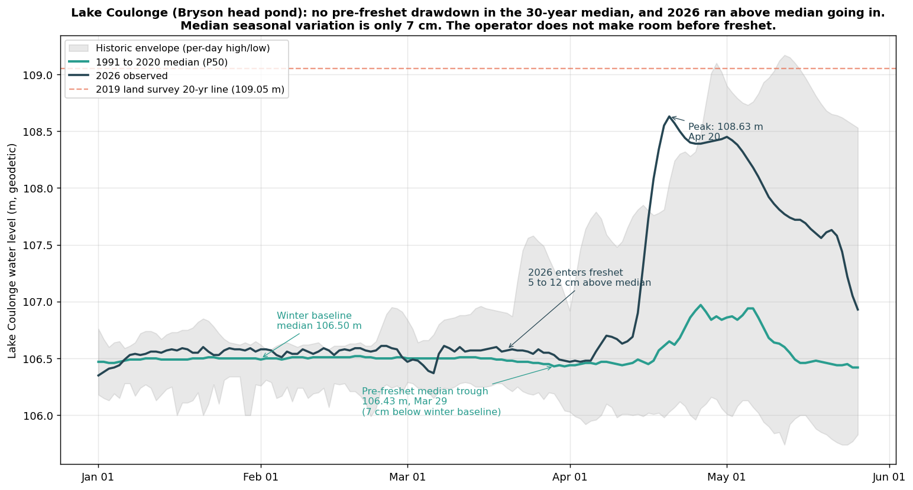

# Bryson does not draw down: 30-year median at the property head pond shows ~7 cm seasonal variation

**Compiled 2026-05-26 using the new orrpb-station-history endpoint. Companion quantitative note to [Exhibit B: Lac Coulonge Winter Baseline](../../docs/exhibits/Exhibit_B_Winter_Baseline.html).**

## Plain language summary

Lac Coulonge (the property's lake, which is also the head pond directly upstream of the Bryson dam) shows essentially no operator-driven drawdown before freshet. The 30-year median (1991 to 2020) holds the lake at about 106.50 m through January and February, dips just 7 cm to a low of 106.43 m on March 29, then rises 54 cm to peak at 106.97 m in late April. For a dam that nominally participates in basin flood management, that is no flood-management posture at all.

The 2026 freshet started from an even worse posture than the 30-year median. Lac Coulonge ran 5 to 12 cm above median through all of March, briefly settled to within 2 to 5 cm of median in the first few days of April, then climbed 198 cm above median to peak at 108.63 m on April 20. The operator entered the 2026 freshet at-or-above the typical winter level, not below it.

This is the quantitative version of Exhibit B's narrative claim that "the buffer was never released." With the new ORRPB per-station ingester live, the numbers behind that claim are now part of the case file in machine-readable form.

## What "drawdown" means here

A flood-management dam with storage room above it draws the head pond down ahead of freshet so the inflow pulse can be absorbed instead of passed through. If Bryson were operated that way, the 1991 to 2020 median at Lac Coulonge would show a clear winter-into-spring dip of 30, 50, or 100 cm before the freshet rise. Instead it shows 7 cm.

The stated Bryson operating band of 104.20 to 104.67 m (HQ local datum, 47 cm wide) describes a generation-optimization range that gets held year-round. There is no seasonal protocol that lowers it before freshet.

## The numbers

Lac Coulonge at Fort-Coulonge gauge, ORRPB published data, 1991 to 2020 median series:

| Window | Median value |
|---|---|
| Winter baseline (Jan 1 to Feb 15) mean median | 106.50 m |
| Winter baseline range | 106.46 to 106.51 m |
| Pre-freshet median trough | 106.43 m (March 29) |
| Drawdown amount in the median | **7 cm** |
| Median freshet peak | 106.97 m (April 26) |
| Median rise from trough to peak | 54 cm |
| Annual median range (Jan low to Sep low) | ~95 cm |

For comparison, the seasonal swings at upstream true-storage reservoirs run 1 to 3 metres ahead of freshet. The headwater storage reservoirs (Baskatong, Bark Lake, Cabonga, Dozois) DO draw down. Bryson does not.

## What 2026 specifically did

| Date | Observed | Median | Above median |
|---|---|---|---|
| 2026-03-15 | 106.57 | 106.50 | +7 cm |
| 2026-03-20 | 106.57 | 106.48 | +9 cm |
| 2026-03-25 | 106.54 | 106.46 | +8 cm |
| 2026-03-30 | 106.49 | 106.44 | +5 cm |
| 2026-04-01 | 106.47 | 106.44 | +3 cm |
| 2026-04-05 | 106.48 | 106.46 | +2 cm |
| 2026-04-10 | 106.67 | 106.45 | +22 cm |
| 2026-04-15 | 107.31 | 106.47 | +84 cm |
| 2026-04-20 | 108.63 | 106.65 | +198 cm (peak) |

The lake ran above median for the entire 36 days of the pre-freshet window. There was no point in March or early April 2026 when the lake was below where the 1991-2020 median says it would typically be.

## What the historic envelope tells us

The same dataset publishes ORRPB's per-calendar-day historic low. For late March, those lows reach as deep as 105.96 m (April 6 historic low, 49 cm below median). This means in some past years the operator (or natural conditions) did pull the lake meaningfully below median pre-freshet. But those years are atypical enough that they do not move the 30-year median.

The case-file Exhibit B documents which prior super-flood years drew down before freshet ("prior super-flood years drew down to or below median first"). 2026 broke that pattern: it neither drew down nor sat at the median going in. It sat above.

## Figure

*Lac Coulonge at Fort-Coulonge, January 1 to June 15, 2026. The grey band is the per-day historic envelope (high/low across the 1988 to 2020 record). The green line is the 1991 to 2020 daily median. The blue line is 2026 observed. The orange dashed line at 109.05 m is the 2019 land survey 20-year flood line at the property. The median dips only 7 cm between mid-winter and the late-March trough. 2026 (blue) ran above median throughout the pre-freshet window before climbing 198 cm to the April 20 peak.*

## Why this matters for the case file

The case file's argument structure includes a layer about operator-controlled levers that are not climate-driven and could change today without legislation. Pre-freshet drawdown at Bryson and at the broader Ottawa cascade is the cleanest example. The data here shows three load-bearing facts:

1. **The 30-year median pre-freshet drawdown at the property head pond is 7 cm.** Operationally that is no drawdown.
2. **2026 ran above that median going into freshet.** The starting line was higher than typical, which compounds rather than buffers the inflow pulse. Exhibit B quantifies this as +14 cm on the freshet peak.
3. **The stated 47 cm operating band at Bryson is not shifted lower before freshet.** It is held in place year-round, which is consistent with run-of-river generation optimization but inconsistent with flood-management responsibility.

These findings support ORFA's *Eight Ways to End the Super Floods* action item on pre-freshet drawdown protocols. The current absence of such a protocol at Bryson is visible directly in the public record, not just inferred.

## Source and methodology

- Data: ORRPB "Lake Coulonge at Fort-Coulonge" daily level series, retrieved via the new `orrpb_station_history` ingester (POST to https://www.ottawariver.ca/location/coulonge/ with table view, daily data type). The ingester also persists per-day median, historic high, and historic low.
- Reference period: 1991 to 2020 daily 50th percentile, as published by ORRPB.
- The case file documents that the ORRPB Lake Coulonge gauge and HQ Bryson amont measure the same water body with different vertical datums (~3 m geodetic vs local offset). The shape of the time series transfers directly; the absolute values do not.
- ORRPB asserts the underlying data "may not be reproduced or redistributed." This note presents only derived statistics (median values, distance from median, day counts) and cites ORRPB as the source.

## Related case-file material

- [Exhibit B: Lac Coulonge Winter Baseline](../../docs/exhibits/Exhibit_B_Winter_Baseline.html): the parent exhibit this note quantifies
- [Exhibit D: Bryson Refurbishment Timeline](../../docs/exhibits/Exhibit_D_Bryson_Timeline.html): operational context for why the band is held steady
- [Pembroke FB thread synthesis](../../docs/analysis/Pembroke_Thread_Synthesis.md): the broader convergent reading of post-2017 operator-side levers
- [Chenaux community note](2026-05-26_chenaux_thread.md) and [Lake Coulonge 2026 community note](2026-05-26_lake_coulonge_2026.md): companion notes using the same ingester
