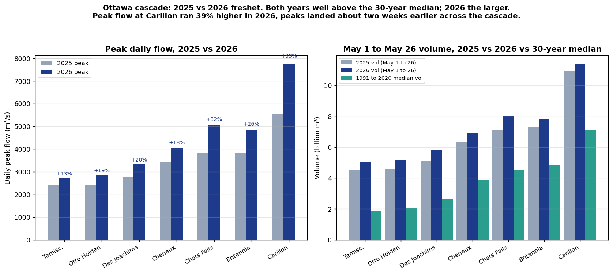

# Ottawa cascade: 2025 vs 2026 freshet, peak flow and volume

**Compiled 2026-05-26 using the new orrpb-station-history endpoint. Companion to the [Lake Coulonge 2026 note](2026-05-26_lake_coulonge_2026.md) and the [Bryson no-drawdown note](2026-05-26_bryson_no_drawdown.md).**

## Plain language summary

The 2026 freshet was larger than the 2025 freshet across the entire Ottawa River dam cascade. Peak flow was 13 to 39 percent higher at the seven measured stations, with the gap growing downstream as tributaries added to the main stem. The May 1 to May 26 volume was 4 to 14 percent higher than 2025 at the same stations.

The much more important framing both numbers sit inside: both years were well above the 1991 to 2020 median. 2025 was not a "normal" freshet either. It was 50 to 170 percent above the cascade's typical May volume. 2026 was the larger of the two, but both years are part of the post-2017 pattern of consistently elevated freshets the case file documents elsewhere.

The 2026 freshet also peaked about two weeks earlier than 2025 at every station. Carillon peaked April 22 in 2026 vs May 4 in 2025. Earlier peaks correlate with warmer spring snowmelt timing.

## Peak daily flow

Across each year's full freshet (not constrained to the May 1 to 26 window because the 2026 peak was on April 21 to 22):

| Station | 2025 peak (m³/s) | 2025 date | 2026 peak (m³/s) | 2026 date | Δ peak |
|---|---|---|---|---|---|
| Temiscaming | 2,415 | May 6 | 2,741 | May 2 | +13% |
| Otto Holden | 2,419 | May 4 | 2,870 | Apr 30 | +19% |
| Des Joachims | 2,780 | May 7 | 3,324 | Apr 30 | +20% |
| Chenaux | 3,452 | May 3 | 4,061 | Apr 21 | +18% |
| Chats Falls | 3,826 | May 3 | 5,046 | Apr 21 | +32% |
| Britannia | 3,845 | May 4 | 4,851 | Apr 22 | +26% |
| Carillon | 5,563 | May 4 | 7,739 | Apr 22 | +39% |

The % gap grows downstream because tributaries between the dams added more to 2026 than to 2025. Specifically, the gap doubles between Des Joachims (+20%) and Chats Falls (+32%), suggesting the Petawawa and the other tributaries that enter that reach delivered notably more in 2026 than in 2025.

## Volume in the matched May 1 to May 26 window

| Station | 2025 vol (Gm³) | 2026 vol (Gm³) | 1991-2020 median vol (Gm³) | 2026 vs 2025 | 2026 vs median |
|---|---|---|---|---|---|
| Temiscaming | 4.52 | 5.03 | 1.87 | +11% | +168% |
| Otto Holden | 4.58 | 5.19 | 2.03 | +13% | +156% |
| Des Joachims | 5.10 | 5.83 | 2.62 | +14% | +122% |
| Chenaux | 6.31 | 6.91 | 3.87 | +9% | +79% |
| Chats Falls | 7.12 | 7.97 | 4.52 | +12% | +76% |
| Britannia | 7.29 | 7.84 | 4.85 | +8% | +62% |
| Carillon | 10.91 | 11.36 | 7.13 | +4% | +59% |

Two readings of the same table:

1. **2026 vs 2025**: 2026 ran 4 to 14 percent higher than 2025 across the cascade. Modest at the basin terminal, larger at the upper-basin stations.
2. **Both years vs the 30-year median**: BOTH years were 59 to 168 percent above the median. The cascade has been operating well above its 1991-2020 normal in consecutive years.

The second reading is more important for the case file. The first is the kind of thing FB threads ask about ("is this year bigger than last year"). The second is the regime-change signal.

## Caveat on the volume comparison

The orrpb-station-history endpoint exposes a 13-month rolling window. For 2025 our data starts May 1, so we cannot include April 2025 in the volume sum. For 2026 we have the full April. The April-2025-vs-April-2026 difference would shift the volume numbers, possibly enlarging or shrinking the gap depending on what 2025 April looked like at each station.

To keep the comparison apples-to-apples we used May 1 to May 26 only, which we have at both years. Peak daily flow is unaffected by this since each year's full peak is in our data (2025 peaks early-to-mid May, 2026 peaks late April).

A full April-plus-May volume comparison for both years will become possible once the ingester has been running for a full year (around April 2027).

## Figure

*Left: peak daily flow per station, 2025 (grey) vs 2026 (navy), with the percent-gap annotated above each pair. Right: May 1 to May 26 cumulative volume per station, with the 1991 to 2020 median for comparison (teal). Both years sit well above the median across the entire cascade.*

## What this means for the case file

The 2025 vs 2026 comparison reinforces the case file's broader regime-change thesis from a different angle. The post-2017 pattern the case file documents (Test A peak-step-location, Test C annual volume) shows up here as: **two consecutive years both well above the 30-year median, with 2026 even larger than 2025**. The fact that 2025 was a "smaller" year and was still 60 to 170 percent above median is what regime change looks like on the ground.

Combined with the no-drawdown finding at Bryson (separate note), the picture for 2026 is: bigger inflow than 2025, no operator buffer set up at the property head pond, peak landed two weeks earlier than 2025, downstream basin terminal flow at 7,739 m³/s (vs 5,563 in 2025).

## Source and methodology

- Flow data from ORRPB published "discharges" series via the new `orrpb_station_history` endpoint (POST to `/location/<slug>/` with `reading-type=discharges`, `data-display=table`, `data-type=daily`).
- Volume = sum of daily flow (m³/s) over the window, multiplied by 86,400 seconds per day, expressed in billions of m³.
- Peak = maximum daily flow value across each year's available data.
- 30-year median = ORRPB's published 1991 to 2020 daily 50th percentile.
- ORRPB asserts the underlying data "may not be reproduced or redistributed." This note presents only derived statistics and cites ORRPB as the source.

## Related case-file material

- [Bryson no pre-freshet drawdown (this run)](2026-05-26_bryson_no_drawdown.md)
- [Lake Coulonge 2026 vs 30-year median](2026-05-26_lake_coulonge_2026.md)
- [Chenaux community thread analysis](2026-05-26_chenaux_thread.md)
- [Freshet 2026 Complete Summary](../../docs/analysis/Freshet_2026_Complete_Summary.md): the parent case-file document covering Tests A, B, C and the Carillon directive enforcement gap
