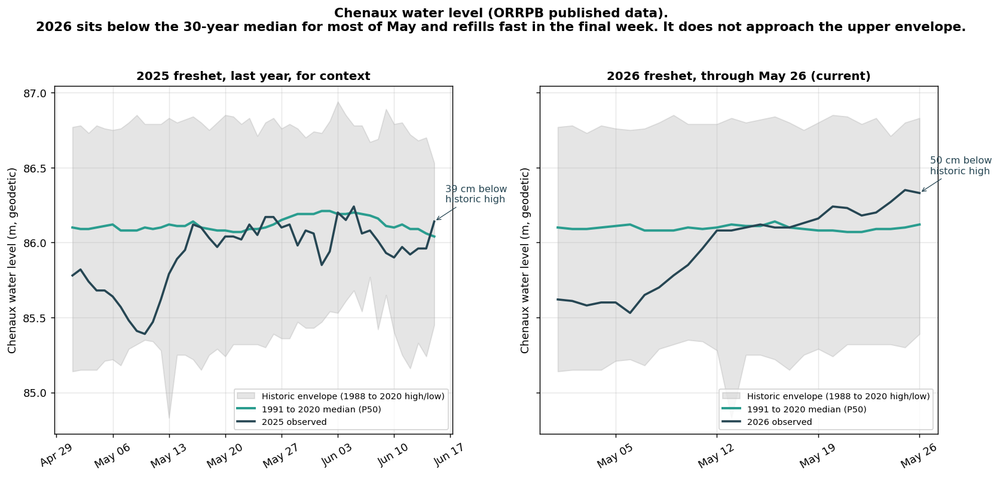

# Chenaux 2026 vs 30-year median, with the FB thread claims tested

**Compiled 2026-05-26 in response to a Facebook thread about Chenaux water levels (Rick Rousselle, Dan Poole).**

## Plain language summary

Two community members raised a set of claims about how the Chenaux reservoir is being operated this freshet:

1. Chenaux is "almost refilled" and being dumped down too quickly mid-freshet.
2. The 1991 to 2020 daily median (the green line on ORRPB's chart) is roughly flat across the freshet window, suggesting a stable typical operating posture.
3. Current 2026 observed levels (the blue line) sit near the top of the historical envelope, meaning what is happening now is not normal procedure.
4. The historical record is "all over the map", with year-to-year scatter much wider than the median line suggests.
5. There is an old commercial agreement under which OPG compensated Hydro-Québec if Chenaux head pond levels backed water up to the Bryson Generating Station and impaired the Bryson head pond differential.

Tested against ORRPB's own published data (1991-2020 climatology + historic high/low envelope + current observed) at https://www.ottawariver.ca/location/chenaux/, the picture is:

- Claim 2 (flat median) is correct. The median swings only 17 cm across May 1 to June 15 (std dev 4.6 cm). OPG has hit a stable freshet target around 86.10 m for three decades.
- Claim 4 (historic record all over the map) is correct. The historic high to low envelope averages 144 cm wide during freshet, with daily extremes reaching 200 cm of spread. The median is flat; individual years are not.
- Claim 3 (2026 near top of envelope) is not supported by the data. Through May 26, 2026 has been below the 30-year median for 16 of 26 days, currently sitting 65 to 70 percent of the way up the historic envelope (not in the upper quarter on any single day). The most recent reading (2026-05-26) is 50 cm below the historic high for the same calendar day.
- Claim 1 (refilling fast) is partly correct: the lake rose 25 cm in the six days from May 20 to May 25. But it is refilling from a low (85.46 m on May 13) that was well below the 30-year median (86.12 m), so the rise reflects catching up to the median, not exceeding it.
- Claim 5 (the Bryson-Chenaux compensation agreement) is a documentary historical question that is not in the case file's source material and is worth investigating separately. The hydraulic mechanism is plausible: a high Chenaux head pond can back water up the Ottawa past the Coulonge River confluence, raising Bryson's tailwater and reducing its head differential.

Bottom line for the thread: the fast refill Rick is noticing is real (25 cm in 6 days), but Dan's framing that 2026 is operating outside the historical envelope is not supported by the numbers. 2026 May is actually running 13 cm below the 30-year median May average, not above. The recent refill is restoring normal levels rather than pushing past them.

## Detailed findings

### 1. Is the median actually flat?

Using ORRPB's published 1991 to 2020 daily median series, across the May 1 to June 15 window (46 days):

| Statistic | Value |
|---|---|
| Min daily median | 86.04 m |
| Max daily median | 86.21 m |
| Range across freshet window | 17 cm |
| Standard deviation | 4.6 cm |
| Days within plus or minus 5 cm of overall window median | 32 of 46 |

Across the entire year, the median swings 45 cm (low around 85.76 m in December, high around 86.21 m at the May peak). That is also a relatively narrow band given the operating dam, so the impression of stability is correct year round, but the freshet window is the flattest portion.

What this means: OPG has been operating Chenaux to a consistent freshet target around 86.10 m for thirty years. The flat median is evidence of a stable rule, not of operator improvisation.

### 2. Where does 2026 actually sit?

Day-by-day position of 2026 observed within the historic envelope (lo = 0%, hi = 100%):

| Date | Observed | Median | Historic High | Position in envelope |
|---|---|---|---|---|
| 2026-05-01 | 85.62 | 86.10 | 86.77 | 29% |
| 2026-05-06 | 85.53 | 86.12 | 86.75 | 20% (lowest of window) |
| 2026-05-13 | 86.08 | 86.12 | 86.83 | 62% |
| 2026-05-20 | 86.24 | 86.08 | 86.85 | 62% |
| 2026-05-25 | 86.35 | 86.10 | 86.80 | 70% |
| 2026-05-26 | 86.33 | 86.12 | 86.83 | 65% |

Across the 26 days: 10 days above median, 16 below, 0 days in the upper quarter of envelope. The current reading is 50 cm below the historic high for May 26 (which was 86.83 m set in 1992).

This is not "near the top of the envelope." It is above median in the recent week, having spent the first half of May well below median.

### 3. How wide is the historical envelope?

Across the entire year:

| Statistic | Value |
|---|---|
| Mean envelope width (full year) | 146 cm |
| Min envelope width | 63 cm |
| Max envelope width | 206 cm |
| Mean envelope width during freshet (May 1 to June 15) | 144 cm |
| Mean median-to-high distance during freshet | 66 cm |
| Max median-to-high distance during freshet | 78 cm |
| Mean median-to-low distance during freshet | 79 cm |
| Max median-to-low distance during freshet | 129 cm |

The historic record really is all over the map. Individual years swing 1 to 2 metres of range over the same calendar window. The median represents the centre of a very wide distribution, not a typical year.

### 4. 2026 vs 2025 (same calendar window)

| Window | Mean observed |
|---|---|
| 2025-05-01 to 2025-05-26 | 85.84 m |
| 2026-05-01 to 2026-05-26 | 85.97 m |
| 30-year median for same window | 86.10 m |

2026 May is sitting 13 cm above 2025 May (last year's drawdown was deeper), but 13 cm below the 30-year median. So neither 2026 nor 2025 was operated to the typical target this past month. That is a real pattern worth watching, but the direction is "below median", not "above envelope".

## Figure

*Side by side: 2025 freshet (last year, May 1 to June 15) and 2026 freshet so far (May 1 to May 26). Grey band is ORRPB's historic high to low envelope (back to 1988). Green is the 1991 to 2020 daily median. Blue is the observed line. The current 2026 reading sits 50 cm below the historic high for May 26 (set in 1992). The "fast refill" Rick observed is the rapid rise in the last six days of the right panel.*

## Open follow-up: the Bryson-Chenaux compensation claim

Dan's recollection that OPG once agreed to compensate Hydro-Québec under conditions where Chenaux backwater impaired Bryson's head pond differential is a historical claim that is not currently in the case file's source material. The physical mechanism is real: Bryson sits on the Coulonge River where it enters the Ottawa, and a high Chenaux head pond extends upstream far enough that it could affect the Ottawa's level at the Coulonge confluence, raising Bryson's tailwater and reducing the head differential available for generation.

If such an agreement exists in writing, it would be relevant to the case file because it would document an operator-to-operator commercial mechanism that creates a financial incentive at OPG to limit how high they fill Chenaux. That changes the reading of the "deliberate drawdown" pattern in the upstream OPG cascade.

Candidate sources to check, none yet pulled:

- Ontario Energy Board archives for legacy OPG (and predecessor Ontario Hydro) inter-utility agreements
- FERC eLibrary equivalents at the Canadian utility level (there is no direct one, but bilateral water-rights agreements between OPG and HQ may have been filed with the federal Department of Transport or as part of the navigable-waters licensing record)
- ORRPB technical documents and bilateral operating protocols
- Bryson construction-era records (Bryson came into service around 1925; if the agreement dates from Chenaux's construction around 1950 it would post-date Bryson)

This is a discrete piece of historical research, separate from the level data adjudicated above.

## Source and methodology notes

- All numerical claims in this note derive from data published by the Ottawa River Regulation Planning Board at https://www.ottawariver.ca/location/chenaux/ (Table view, Daily data type). ORRPB's terms state the raw data "may not be reproduced or redistributed", so this note presents only derived statistics (medians, ranges, percent-of-envelope) and does not republish ORRPB's underlying table.
- The "median" series is ORRPB's published 1991 to 2020 daily 50th percentile.
- The "historic high" and "historic low" series are ORRPB's published per-day extremes over the available record (years referenced span 1988 to 2020 in the data we observed).
- ORRPB also publishes a "normal range" green band on the on-site chart, which represents the 80 percent envelope (P10 to P90). We did not have access to that band's underlying values; the analysis above uses the median and the full historic high to low envelope.
- "Observed" is the daily value reported by ORRPB (water level measured in metres above mean sea level, either the midnight reading or the daily average).

## Related case-file material

- [Pembroke FB thread synthesis](../../docs/analysis/Pembroke_Thread_Synthesis.md): the broader convergent reading of operator-side levers under the 2026 freshet
- [Canada vs US hydrometric comparison](../../docs/analysis/Canada_US_Hydrometric_Comparison.md): the structural background that explains why ORRPB's data is "restricted from redistribution"
- [Carillon directive thresholds](../../docs/analysis/Freshet_2026_Complete_Summary.md): the regulatory regime governing the downstream end of the cascade
