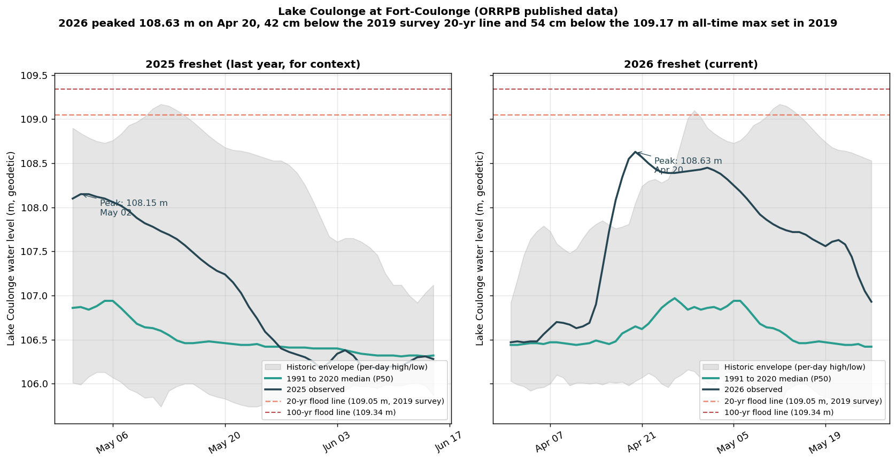

# Lake Coulonge 2026 freshet vs the 30-year median and historic envelope

**Compiled 2026-05-26 using the new orrpb-station-history endpoint to demonstrate the broader case-file capability the Chenaux thread analysis unlocked. ORRPB published data, 1991-2020 reference period.**

## Plain language summary

The 2026 freshet at Lake Coulonge (the gauge at Fort-Coulonge that sits in the dam pond at the foot of the lake, this is the public-record gauge for the property's lake) peaked at **108.63 m on April 20, 2026**. That figure carries three useful comparisons:

- **About 2 metres above the typical late-April level.** The 1991-2020 daily median for April 20 at this gauge is 106.65 m. The 2026 peak ran 198 cm above that median.
- **42 cm below the 2019 land survey 20-year flood line of 109.05 m.** The same survey marks the 100-year line at 109.34 m, putting the 2026 peak 71 cm below the 100-year and well inside the river's historical operating range.
- **54 cm below the all-time max for this gauge of 109.17 m, set on May 12, 2019.** That was the basin's recent record freshet. 2026 was a serious freshet but not a record-breaking one.

The current value (as of May 26) is 106.93 m, 51 cm above the median for the day, sitting comfortably in recession.

The most striking finding from looking at the entire historic-high record (1991-2020 reference period) is that **2019 alone holds the daily high on 61 days of the year**, by far the most of any year on record. The runner-ups are 2016 (35 days), 2008 (22), 2012 (21), and 2001 (20). Six of the top eight record-setting years at Lake Coulonge come from the post-2008 window. This is what the case file's broader "post-2017 freshet regime change" argument predicts visible at the individual-station level.

## Detailed findings

### 2026 freshet peak in context

| Metric | Value |
|---|---|
| Peak date | 2026-04-20 |
| Peak observed | 108.63 m |
| Median for that day (1991-2020) | 106.65 m |
| Peak above median | 198 cm |
| Per-day historic high (April 20, 2002) | 108.05 m |
| Peak above per-day historic high | 58 cm (a new April 20 record) |
| All-time max at this gauge | 109.17 m (May 12, 2019) |
| Peak below all-time max | 54 cm |
| 2019 land survey 20-year flood line | 109.05 m |
| Peak below 20-year line | 42 cm |
| 2019 land survey 100-year flood line | 109.34 m |
| Peak below 100-year line | 71 cm |

The 2026 peak was a per-calendar-day record at Lake Coulonge for April 20 (the previous April 20 record was 108.05 m in 2002), but the broader freshet peaked earlier and lower than 2019's record. 2026 is consistent with the post-2017 freshet regime in volume but did not test the property survey 20-year line the way 2019 did.

### 2025 vs 2026

| Year | Peak observed | Peak date |
|---|---|---|
| 2025 | 108.15 m | 2025-05-02 |
| 2026 | 108.63 m | 2026-04-20 |
| Difference | +48 cm in 2026 | 12 days earlier in 2026 |

Two consecutive years of significant freshets, with 2026 peaking 48 cm higher and almost two weeks earlier than 2025. The earlier peak date is consistent with warmer spring snowmelt timing.

### 30-year median during freshet

| Statistic | Value |
|---|---|
| Apr 1 to Jun 15 median range | 106.31 m to 106.94 m |
| Swing across the freshet window | 63 cm |
| Std dev | 19 cm |

The Lake Coulonge median has more shape across the freshet window than the Chenaux median did (Chenaux swung 17 cm, Lake Coulonge swings 63 cm). That difference reflects what the gauges actually measure: Chenaux is a head pond regulated to a flat target by OPG, Lake Coulonge is a downstream river-segment level that tracks inflow more directly and is less flat by design.

### Today vs median

| Date | Observed | Median | Above median |
|---|---|---|---|
| 2026-05-26 | 106.93 m | 106.42 m | 51 cm |

The lake is now in recession, sitting half a metre above median. Operators have been drawing down the lower-cascade reservoirs (see the [Chenaux community note](2026-05-26_chenaux_thread.md)) consistent with the standard recession pattern, but Lake Coulonge itself doesn't have a meaningful head pond so it tracks the main-stem flow plus the local Coulonge River inflow.

### Which years dominate the historic-high record

Days where each year holds the per-calendar-day record at Lake Coulonge (1991-2020 reference period and the years it cites):

| Year | Days holding the record | Notes |
|---|---|---|
| 2019 | 61 | The basin's recent record freshet |
| 2016 | 35 | Mid-spring freshet pattern |
| 2008 | 22 | |
| 2012 | 21 | |
| 2001 | 20 | |
| 2014 | 19 | |
| 1981 | 18 | Only pre-2000 year in the top 8 |
| 2015 | 17 | |

Six of the eight years that own the most record days at Lake Coulonge come from the post-2008 window. This is the regime-change signal the case file documents in flow at Britannia (Test A) showing up directly in the published per-day historic high envelope at the property gauge.

## Figure

*Side by side: 2025 and 2026 freshet at the Lake Coulonge gauge (Fort-Coulonge). Grey band is ORRPB's historic high to low envelope. Green is the 1991-2020 daily median. Blue is observed. Orange dashed lines mark the 2019 land survey 20-year (109.05 m) and 100-year (109.34 m) flood lines. The 2026 peak of 108.63 m landed 42 cm below the 20-year line and 54 cm below the 109.17 m all-time max set in 2019.*

## What this demonstrates for the case file

The new ingester (`orrpb-station-history`, see `k3s/base/data/orrpb-station-history.yml` and `freshet-public/ingesters/orrpb-station-history/`) gives the same kind of "current vs 30-year median vs historic envelope" view that ORRPB provides on its own location pages, but now queryable from PostgREST for every monitored cascade location. Capabilities enabled:

- **Per-day historic-high attribution.** We can now see which year set each day's high at Lake Coulonge, Pembroke, Carillon, Hull dock, and the other cascade locations directly. This is the data behind Test A's "post-2017 regime change" thesis, now visible per-station.
- **2026 vs the multi-decade record at the property gauge specifically.** Until today the case file relied on Britannia (the longest-record main-stem station, 1915 to 2024) as a proxy for the property gauge. With the new ingester, we can analyze Lake Coulonge directly with its own 1991-2020 reference period.
- **Cross-checking the Carillon directive.** Hull dock today (May 26, 2026) is 42.68 m at this gauge, above the 42.61 m servitude trigger that activates the 40.08 m spring-flood ceiling at Carillon under §15.3.5.1. This is an independent confirmation from the per-station endpoint that the directive trigger is currently active. (Carillon amont today is 40.50 m, 42 cm above the 40.08 m ceiling. Same overshoot pattern we have documented through the entire 2026 flood period.)

## Source and methodology

- All numerical claims derive from data published by the Ottawa River Regulation Planning Board at https://www.ottawariver.ca/location/coulonge/ (Table view, Daily). ORRPB asserts the underlying data "may not be reproduced or redistributed", so this note presents only derived statistics and does not republish the raw daily table.
- The median series is ORRPB's 1991-2020 daily 50th percentile.
- The historic high and low series are ORRPB's per-day extremes over the available record (years 1981 to 2020 referenced in the data we observed).
- Property survey 20-year and 100-year elevations are from the 2019 land survey of the property, which the case file documents as aligned to the ORRPB Lake Coulonge gauge datum within plus or minus 5 cm.

## Related case-file material

- [Chenaux community note (2026-05-26)](2026-05-26_chenaux_thread.md): the first community note using the new per-station endpoint, testing FB-thread claims at Chenaux
- [Pembroke FB thread synthesis](../../docs/analysis/Pembroke_Thread_Synthesis.md): the broader convergent reading of post-2017 operator-side levers
- [Freshet 2026 Complete Summary](../../docs/analysis/Freshet_2026_Complete_Summary.md): the parent case file describing Tests A, B, C and the Carillon directive enforcement gap
