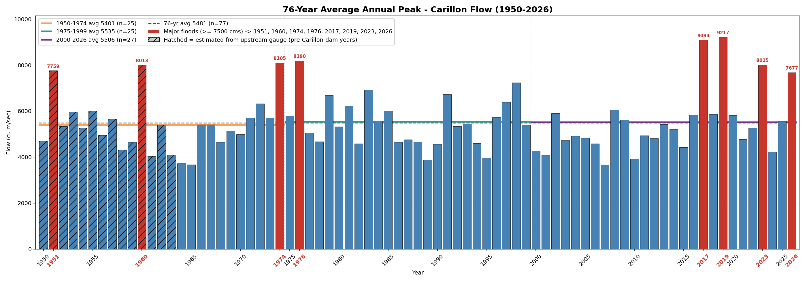
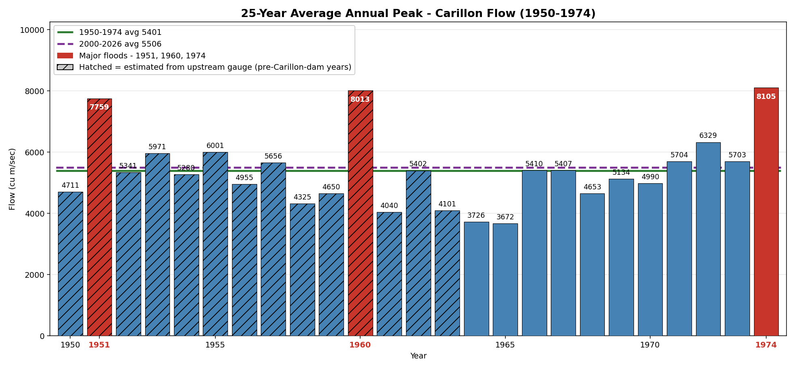
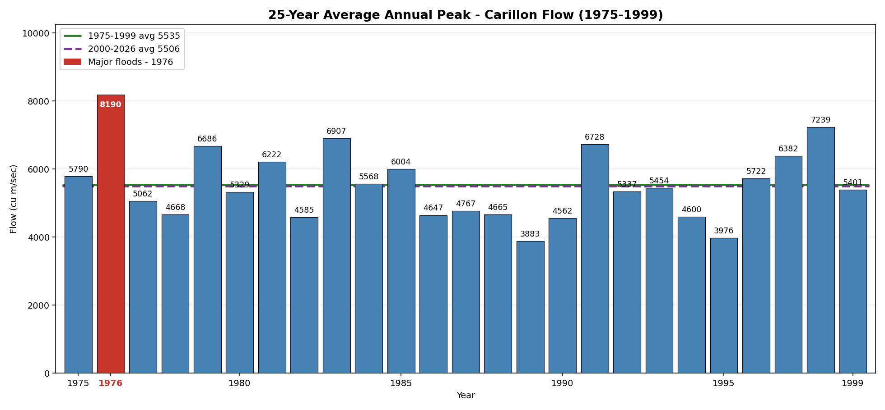
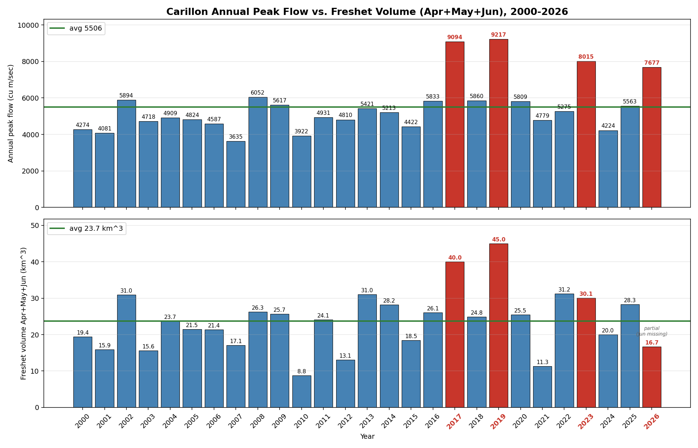
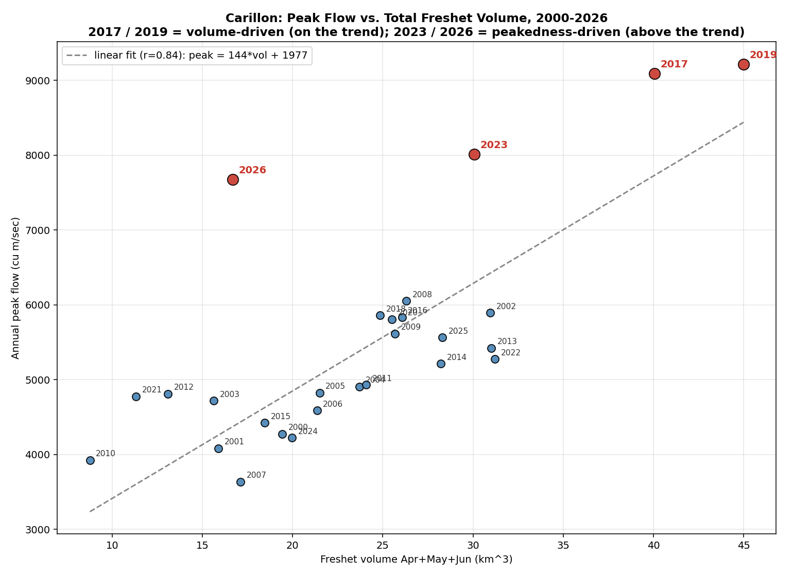

# 76 years of Carillon flow, one chart at a time: answering two questions from the FB thread

**Compiled 2026-05-27 in response to questions from Kathy Black and Larry Norman on the "Big Picture" thread (Andy Taylor / Dan Poole) about Carillon peak flow.**

## Plain language summary

Two readers asked the obvious next questions after seeing the 2000-2026 Carillon peak-flow chart:

1. **Kathy Black:** "Can you do the same chart for the two 25-year windows before 2000?"
2. **Larry Norman:** "Can you do the same chart for total freshet volume, not just peak?"

Both are answered below. The short version is:

- **The 25-year averages have not changed.** 1950 to 1974 averaged 5,401 cms. 1975 to 1999 averaged 5,535 cms. 2000 to 2026 averaged 5,506 cms. The three windows are essentially flat.
- **The big change is the clustering of flood years.** In the 50 years from 1950 to 1999 there were 4 peak-flood years scattered across that half-century (1951, 1960, 1974, 1976). In the 10 years from 2017 to 2026 there have been 4 peak-flood years in a row (2017, 2019, 2023, 2026). The rate went up by a factor of 5.
- **The four recent floods are not all the same kind of flood.** 2017 and 2019 sit on the trend line between volume and peak: more total water came down the basin, so the peak rose proportionally. 2023 and 2026 sit clearly above the trend: the total water was ordinary, but it arrived faster. That distinction matters for what dam operators can and cannot influence.

What follows walks through each chart so the reader can see how those numbers come out of the data.

## Figure 0: The whole picture, 1950 to 2026

*All 76 years of Carillon annual peak flow on one chart. Blue bars are normal years. Red bars are flood years (peak ≥ 7,500 cms). Hatched bars (1950 to 1963) are estimated from upstream Chats Falls gauge, because the Carillon dam was not yet operating. The three coloured horizontal lines are the window averages: orange = 1950 to 1974, green = 1975 to 1999, purple = 2000 to 2026. The grey dashed line is the 76-year average.*

This is the visual answer to the thread's question in one chart. **The three coloured average lines sit on top of each other**, between 5,401 and 5,535 cms, which is what "the 25-year averages have not changed" looks like graphically. The grey dashed long-run average runs at 5,481 cms across the full record.

The red bars tell the rate-change story. **In the first 50 years (1950 to 1999), four floods are spread thinly across the record:** 1951, 1960, 1974, 1976. The gap between 1976 and the next flood is 41 years. **Then between 2017 and 2026, four floods occur in 10 years.** Visually, the right end of the chart is denser in red bars than any prior decade.

The chart also makes clear that floods do happen at Carillon outside the recent decade. There was one in 1951, one in 1960, and two close together in 1974 and 1976. What is unprecedented is the *clustering*, not the *occurrence*. Figures 1 and 2 break that into the two prior 25-year windows that Kathy specifically asked for.

## Figure 1: Carillon peak flow, 1950 to 1974

*Annual peak daily flow at Carillon, 1950 to 1974. Blue bars are normal years, red bars are flood years (defined here as peak ≥ 7,500 cms to match the four red bars in the original 2000-2026 chart). Hatched bars (1950 to 1963) are estimated, because the Carillon dam itself was not operating until 1964; see "How we extended back before 1964" below. The green line is the 25-year window average. The purple dashed line is the 2000 to 2026 average for comparison.*

The Carillon dam was built between 1959 and 1962 and reached full operation in 1964. So the published Carillon flow record only starts in 1964. For the years 1950 to 1963 we estimated the equivalent Carillon flow by regression against an upstream Ottawa River gauge (Chats Falls, WSC 02KF009) that was operating for the entire period. The Chats Falls record correlates with Carillon at r = 0.76 across their 31-year overlap (1964 to 1994), which is good enough to flag the major flood years but not precise enough to read individual bar heights to the cms.

What the chart shows: a relatively quiet quarter-century with three flood years scattered across it. **1951** stands out as the highest pre-dam estimate at about 7,759 cms. **1960** was estimated at about 8,013 cms (both numbers are regression estimates from Chats Falls, so treat the exact values with caution; what is robust is that both years cleared the flood threshold). **1974** was a directly measured 8,105 cms, the largest of the three and the start of the 1974-1976 flood cluster. Between flood years, the early 1960s were notably dry (1961, 1963 both below 4,200 cms).

**The 25-year average is 5,401 cms,** essentially identical to the 2000 to 2026 average of 5,506 cms.

## Figure 2: Carillon peak flow, 1975 to 1999

*Annual peak daily flow at Carillon, 1975 to 1999. All bars are directly measured (no regression needed). Same colour convention and reference lines as Figure 1.*

This is the chart Kathy specifically asked for. **In 25 years, only one flood year cleared the 7,500 cms threshold: 1976.** That year was the immediate echo of the 1974 spring flood and is usually treated as part of the same multi-year cluster. After 1976 the record shows 23 years without a single peak above 7,300 cms. The highest non-flood year in the window was 1998 at 7,239 cms.

The window average is **5,535 cms**, again essentially identical to the other two windows. The visual story is "a wide spread of normal years, almost no extremes."

This is the period that, on Jennifer Buttars' FB framing of "38 years of management," is the textbook quiet era. Whether that quiet was *caused* by management decisions, or was an accident of the meteorology of those decades, is a separate question. What the chart establishes is that the quiet was real.

## Figure 3: Peak and volume, side by side, 2000 to 2026

*Top panel: same annual peak flow chart as the original (cu m/sec). Bottom panel: total freshet volume for the same year (km³ of water passing Carillon in April + May + June, which is the standard Ottawa freshet window). Red bars in either panel mark the four flood-peak years.*

This is the first half of Larry Norman's question. The bottom panel computes total freshet volume from the same Carillon record (monthly mean flow times days in the month, integrated over April, May, June, converted to cubic kilometres). The 27-year volume average is **23.7 km³ of water through Carillon between April 1 and June 30.**

Reading the two panels together flags one immediate observation. **2017 and 2019 are red in both panels.** Their peaks were record-setting *and* their freshet volumes were record-setting (40.0 and 45.0 km³). These are large-water years in the simple sense: more total water came down the basin in those Aprils, Mays, and Junes than in any other year on the record.

**2023 and 2026 are red in the top panel but ordinary in the bottom panel.** 2023's volume was 30.1 km³, identical to 2013 (31.0 km³) or 2022 (31.2 km³). 2026's partial volume so far is 16.7 km³, which is on track for an ordinary or even below-average freshet total. Yet both years produced flood-level peak flows. Same water budget as a normal year, but a much higher peak.

The 2026 volume is marked partial for two reasons. First, June has not happened yet at the time of writing (May 27). Second, the Carillon outflow record we draw from for 2026 starts April 22, because Hydro-Québec's public hourly feed for Carillon only began carrying data on that date this year; we are missing Apr 1 to Apr 21. The partial volume shown (16.7 km³) reflects only the days we observed directly. Even with a generous projection of full April and a normal-shape June recession, 2026 is unlikely to land in the 2017/2019 volume class. The peak value (7,677 cms) is what it is and is not affected by the partial-coverage issue.

## Figure 4: Peak versus volume, on one chart

*Each dot is one year, 2000 to 2026. Horizontal axis is the year's total freshet volume in km³. Vertical axis is the year's peak daily flow in cms. Grey dashed line is the linear best-fit (r = 0.84). Red dots are the four flood-peak years.*

This is the second half of Larry Norman's question and the part where the answer turns surprising.

Across 26 normal-coloured years, peak flow tracks volume very closely. The relationship is **peak ≈ 144 × volume + 1,977**, which is just the physical fact that a year carrying more total spring water also tends to peak higher. About 70 percent of the year-to-year variation in peak flow can be explained by volume alone.

The four flood years split into two groups:

- **2017 and 2019 sit *on* the trend line.** Their peaks were predictable from their volumes. There was simply more water in those freshets than in any other year on the modern record, and the peak rose accordingly. These are the years where Peter James's framing fits exactly: the water had to come down at some point, and there was a lot of it.
- **2023 and 2026 sit clearly *above* the trend line.** 2023 produced an 8,015 cms peak from a 30 km³ freshet, the same volume that produced 5,421 cms in 2013 and 5,275 cms in 2022. 2026's partial volume so far is 16.7 km³, comparable to the full-year volume in dry years like 2003 (15.6 km³) or 2007 (17.1 km³), where peaks stayed below 5,000 cms; yet 2026's peak has already reached 7,677 cms. Whatever drove 2023 and 2026's peaks, it was not the total amount of water.

This is the empirical version of the "peakedness" question. In the same total volume, water can come down spread out (a long flatter freshet, which produces a low peak) or concentrated (a sharp freshet, which produces a high peak). 2023 and 2026 are concentrated freshets. The cause is at least partially physical, namely faster snowmelt or rain-on-snow events that compress the runoff window. Whether dam-operator timing decisions sharpened or softened the peak in those specific years is the regulatory question that Exhibit B and the broader case file engage in detail.

## What this means for the thread

The thread asked some good questions. Pulling them together with the four charts:

- **David Alexander's question** ("isn't flow the amount the dam lets through?"): yes, Carillon's published flow is its outflow, which is also nearly all the water leaving the entire Ottawa basin. Carillon has very limited buffering capacity itself (its head pond is small), so on freshet timescales the outflow tracks the basin inflow with a few hours of lag.

- **Kathy Black's first question** (1950-1974 and 1975-1999 charts): provided in Figures 1 and 2. The 25-year averages are flat across all three windows. What changed is the rate of flood years, not the typical-year flow.

- **Andy Taylor's hardscape / new-development hypothesis**: would predict a rising 25-year average over time. The data does not show that. The average is flat. Hardscape may contribute to peakedness on tributaries near urban areas, but it is not visible as a basin-wide volume signal at Carillon.

- **Kathy Black's follow-up operational questions** (the four she asked after the chart): each has a specific answer from the existing case-file material. See the dedicated section "Kathy Black's four follow-up questions" below.

- **Steve Laycock's precipitation overlay**: would require ECCC station precip and SWE history, which is in our backlog but not in this set.

- **Peter James's "the water has to come down" framing**: confirmed for 2017 and 2019 by Figure 4. Those were genuinely volume-bound freshets. **Not confirmed for 2023 and 2026**: those were peakedness-bound, where the same volume could in principle have produced a much lower peak if delivery had been less concentrated.

- **John Pomeroy's "the basins fill in hours" point**: physically correct for free-flowing reaches, and is the reason that on a peak-rate basis the upstream basins don't help much. But on a peakedness basis (Figure 4 above the trend line), the upstream storage reservoirs that DO have significant freshet-scale capacity (the four headwater reservoirs Kathy listed, plus Bark Lake) could in principle shave the peak if they were drawn down further pre-freshet. That is the ORFA action item.

- **Larry Norman's volume question**: Figures 3 and 4. The 27-year freshet volume average is 23.7 km³. The largest were 2019 (45 km³) and 2017 (40 km³). The smallest was 2010 (8.8 km³). 2026's volume through May 27 is 16.7 km³; the final number depends on June 2026, but even with an average post-peak recession 2026 is unlikely to reach the 2017/2019 volume class.

## Kathy Black's four follow-up questions

After listing the 13 reservoirs that feed Carillon, Kathy posed four specific operational questions. Three of them are directly testable from the case file. The fourth is real but outside our data.

### "What's changed?"

The 25-year averages have not changed (Figures 0 to 2). What changed is two things, in this order:

1. **The clustering of flood years rose by a factor of five.** Four floods in 50 years (1950 to 1999) became four floods in 10 years (2017 to 2026).
2. **The character of the most recent two floods shifted from volume-driven to peakedness-driven.** 2017 and 2019 were genuinely huge water years. 2023 and 2026 produced flood-level peaks out of ordinary or below-average total water (Figure 4). That is the diagnostic difference. A volume-driven flood is hard to manage with reservoir storage because there is too much total water. A peakedness-driven flood is, in principle, the kind of flood that pre-freshet drawdown and ramp-rate discipline could shave.

### "Are reservoir operators running them higher?"

**Mostly no, for 2026 specifically. But it depends which dam, and the test only goes back to 1990.** The case file has a 36-year (1990 to 2025) ORRPB archive of daily level data for all 13 reservoirs Kathy listed. The 2026 [Reservoir Drawdown community note](2026-05-22_reservoir_drawdown.md) checked April-1 level against each reservoir's published operating band and found:

- **9 of 13 reservoirs were at the bottom third of their operating range or lower on April 1, 2026,** including every reservoir that drains to the upper Ottawa River (Timiskaming, Kipawa, Quinze, Rapide-7, Dozois, Lady Evelyn).
- **The four exceptions were Cabonga (60% of band), Kiamika (45%), Mitchinamecus (43%), and Bark Lake (43%).** All four sit on the Gatineau, Lièvre, or Madawaska rivers, which join the Ottawa main stem *downstream* of Lac Coulonge / Pembroke. So they did not affect the upper-river property's freshet peak, but they did affect the lower river including Britannia, Ottawa-Gatineau, and Carillon.
- **One downstream dam was being held *up*, not down.** Bryson (run-of-river, immediately downstream of Lac Coulonge) was kept above its winter norm by 0.75 m through January and February, above the 90th historical percentile on 41 of 59 winter days. The case file's [Bryson No-Drawdown community note](2026-05-26_bryson_no_drawdown.md) documents this specifically.

So the answer is genuinely "it depends which dam." Storage reservoirs feeding the upper river: drawn down well. Mid-cascade run-of-river dams like Bryson: held up. Storage reservoirs feeding the lower tributaries: drawn down only to mid-band.

### "Are they not emptying to published low level limits?"

**That is correct. Operators drew down to the long-run median, not the published floor.** This is also from the [Reservoir Drawdown community note](2026-05-22_reservoir_drawdown.md). For example:

- Quinze hit 23.8% of operating band on April 1, 2026, exactly at its 30-year median for that date.
- Baskatong hit 12.9%, also at its 30-year median.
- Their licensed low-level limits are at the bottom of the operating band (0% in this normalised view).

This is exactly Dan Poole's framing on the FB thread: "drew down to median but not to floor." It is consistent with long-standing operating practice. The published low-level limits exist in the operating licences and are not being violated, but the operators are not aiming for the floor; they are aiming for the median. The licensed range is wider than the practiced range.

This matters because the median was calibrated on the 1990s climate. With 2017-2026 producing five flood years where the prior 25-year window had one, the median is no longer the right operating target. **The fix is at the regulator level, not the operator level.** ORFA's *Eight Ways to End the Super Floods* (Action 4) proposes a snowpack-indexed drawdown requirement written into the operating licences themselves.

### "Are the automated SWE maps not as accurate as manual snow pack measurement?"

This is a fair question and outside what our data can directly answer.

What we can say: SWE (Snow Water Equivalent) is the input the basin's snowmelt models use to forecast inflow. Operators (HQ, OPG, MELCC) use a blend of:

- **Manual snow courses** measured by ground crews at fixed locations, typically biweekly through winter.
- **Automated products** like NRC's CMC SWE analysis or NOAA SNODAS, which combine satellite, model, and ground inputs.

There is a well-known operational concern in cold-region hydrology that automated SWE products tend to under-estimate SWE in dense forest cover and over-estimate it in open clearings, both of which the Ottawa basin has in quantity. If operators are sizing drawdown to an automated SWE forecast that systematically under-reads, they will draw down too little and arrive at April 1 with too much water in the system.

That is exactly the failure mode that would produce 2017 and 2019 (volume-driven floods, where the model under-counted how much water was coming). It is a weaker explanation for 2023 and 2026 (peakedness-driven), where the issue is more about runoff timing than total volume.

**Whether automated SWE is in fact systematically biased in the Ottawa basin is testable** by comparing operator inflow forecasts to actual observed inflows year by year, but neither operator publishes their internal forecast on a daily basis, so this would require an access-to-information request. It is on the case-file backlog but not in this exhibit.

## How we extended back before 1964

The published Carillon outflow record begins in 1964 because the dam itself only began operating then. Before 1964, what flowed past the same point in the river was the natural Ottawa River, but no gauge there was producing the same daily-mean flow value that the dam's outflow records produce now.

To extend Figure 1 back to 1950, we used WSC station 02KF009 (Ottawa River at Chats Falls), which produced daily flow records continuously from 1915 to 1994. Chats Falls is on the Ottawa main stem near Arnprior, roughly 150 km upstream of Carillon. The Gatineau River and a handful of other tributaries join between Chats Falls and Carillon, which is why the Chats x Carillon correlation is good but not perfect (r = 0.76 in the 1964 to 1994 overlap).

The conversion is: **Carillon_peak ≈ 1.016 × ChatsFalls_peak + 2,120**. We applied that linear conversion to the Chats Falls annual peaks for 1950 to 1963 and plotted those as hatched bars. The hatching is a visual reminder that those values are estimated, not direct measurements. They are good enough to identify the major flood years (1951, 1960) but should not be read to the nearest cms.

The 1964 to 1974 bars (the last 11 years of Figure 1) and all 25 bars of Figure 2 are direct ORRPB measurements with no estimation.

## Sources and method

- **1964 to 2025 Carillon outflow:** ORRPB historical summary CSV, `data/orrpb-historical-summaries/ottawa-river-at-carillon.csv`. Provides monthly mean flow plus annual daily maximum and minimum.
- **2026 Carillon outflow:** Hydro-Québec public hourly feed for site 3-60 (Carillon), aggregated to daily means. Coverage begins April 22, 2026.
- **1950 to 1963 Chats Falls flow:** WSC HYDAT extract, station 02KF009, `data/wsc-hydrometric/chats-falls-ottawa-river/daily.csv`. Daily flows from 1915 to 1994.
- **Flood threshold:** 7,500 cms peak daily flow, chosen to match the four red bars in the original 2000 to 2026 chart (2017, 2019, 2023, 2026 are all above; 2008's 6,052 cms and 1998's 7,239 cms are below).
- **Freshet volume:** April mean × 30 days + May mean × 31 days + June mean × 30 days, converted from cms-days to km³ (m³/s × 86,400 s/day × 91 days ÷ 10⁹).
- **Reproduction scripts:** [`kathy_black_historical_carillon.py`](../../ingesters/climate-history/kathy_black_historical_carillon.py) and [`larry_norman_peak_vs_volume.py`](../../ingesters/climate-history/larry_norman_peak_vs_volume.py).

## Related material

- [Exhibit B: Lac Coulonge Winter Baseline](../../docs/exhibits/Exhibit_B_Winter_Baseline.html), parent exhibit on pre-freshet drawdown
- [Pembroke FB thread synthesis](2026-05-23_pembroke_2023_vs_2026.md), the previous community note about the same year-on-year question at Pembroke
- [Pre-freshet reservoir scout](../../ingesters/climate-history/pre_freshet_reservoir_scout.py), the analysis of which upstream reservoirs actually drew down before each freshet
