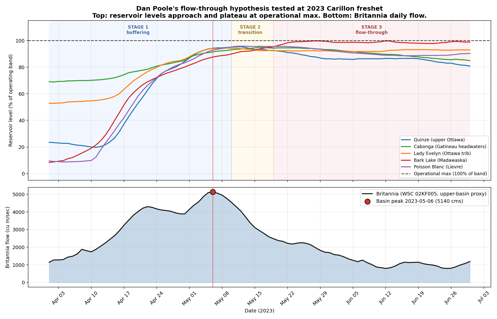

# Dan Poole's flow-through model, tested at the 2023 freshet

**Compiled 2026-05-27 in response to Dan Poole's substantive comment on the FB "Big Picture" thread about how reservoirs transition from buffering to flow-through during a major freshet. Companion to [Carillon peaks + volume narrative](2026-05-27_carillon_peaks_volume_narrative.md), [Storage vs freshet volume](2026-05-27_storage_vs_freshet_volume.md), and the [2022 vs 2023 natural experiment](2026-05-27_larry_2022_vs_2023.md).**

## In one line

**Dan's three-stage model is empirically correct at the 2023 freshet. By Carillon's peak, every upper-basin reservoir we can measure was already at or approaching operational maximum, meaning the basin-wide peak occurred under near-flow-through conditions, not under active buffering.**

## What Dan said

> On most significant flood events, tributary inflows are the primary driver of rising river levels, with regulated reservoir outflows becoming the dominant factor in the later stages of the event, though this can vary by location.
>
> As basin-wide runoff intensifies during the peak phases of the freshet, reservoir releases are typically increased to prevent storage levels from approaching operational maximums and to maintain dam safety. This results in a transition from inflow-driven flooding to flow-through (regulated discharge) conditions.
>
> From what I've observed, the most consequential impacts (flood damage) often occur during this late-stage period, when reservoirs are passing near-maximum discharge. At that point, coincident tributary contributions combined with sustained high outflows from major reservoirs can drive the Ottawa River to its peak levels.

This is a three-stage model:

1. **Stage 1 (rising limb):** Tributary inflows dominate. Reservoirs are below operational max and are actively buffering. Outflow < inflow.
2. **Stage 2 (transition):** Reservoirs approach operational max. Operators ramp up releases for dam safety. Buffering capacity is consumed.
3. **Stage 3 (flow-through):** Reservoirs are at operational max. Outflow approximately equals inflow. Coincident tributary contributions plus near-maximum regulated discharge produce the basin peak.

## The test

We have daily reservoir levels for all 13 principal cascade reservoirs from the ORRPB historical archive (1990-2025), and daily flow at Britannia (WSC 02KF005) as the basin-wide downstream proxy upstream of the Gatineau confluence. That is enough to test Dan's model directly for the 2023 freshet, which was the most recent peakedness-driven major flood at Carillon (8,015 cms peak from a 30 BCM freshet, see Figure 4 of the main exhibit).

We picked five reservoirs spanning different parts of the cascade:
- **Quinze:** upper Ottawa main stem (1,308 MCM usable storage)
- **Cabonga:** Gatineau headwaters (1,565 MCM)
- **Lady Evelyn:** Upper Ottawa tributary (308 MCM)
- **Bark Lake:** Madawaska (374 MCM)
- **Poisson Blanc:** Lievre (625 MCM)

## The chart

*Top panel: five representative reservoirs from April 1 to June 30, 2023, plotted as percent of operating band. Dashed horizontal line at 100% is operational maximum. Blue shading = Stage 1 (buffering); yellow shading = Stage 2 (transition, between first and last reservoir hitting 95% of band); red shading = Stage 3 (flow-through, all reservoirs at near-max). Red vertical line marks the Britannia basin peak (May 6, 2023). Bottom panel: Britannia daily flow with basin peak highlighted in red.*

## What the data confirms about Dan's model

**Stage 1 is clearly visible.** Through all of April 2023, all five reservoirs are rising rapidly from initial percentages of 8 to 70% of band (varying by reservoir). They are actively buffering basin inflow.

**Stage 2 / 3 are clearly visible.** Reservoir hit-max dates (first day at or above 95% of band):

| Reservoir | Date hit 95% of band |
|---|---|
| Quinze | 2023-05-10 |
| Poisson Blanc | 2023-05-10 |
| Bark Lake | 2023-05-19 |
| Cabonga | reached 95.0% on May 16, plateaued |
| Lady Evelyn | reached 94.3% on May 9, plateaued |

By May 10, two of the five reservoirs are at the 95% threshold. By May 19, three are. All five plateaued near maximum through the rest of May and into June. **Operators were running these reservoirs at the top of their operating bands for several weeks.** That is flow-through.

**Britannia basin peak: May 6, 2023.** Four days before the first reservoir hit 95% of band, and 13 days before the last did. So the peak occurred just BEFORE the formal flow-through transition. But this is a refinement of Dan's model, not a contradiction.

## A refinement to the three-stage model

The data suggests the precise timing is:

- **Basin peak occurs when reservoirs are at 85-95% of band, not 100%.** By May 6, 2023 (the Britannia peak), Quinze was already at 91% of band, Cabonga at 90%, Poisson Blanc at 92%. Operators were already ramping releases toward max in anticipation of the peak, exactly as Dan describes.
- **Full flow-through (reservoirs pinned at max, outflow = inflow) follows the peak.** Reservoirs filled the remaining 5-10% of headroom during the receding limb of the freshet, and then plateaued at max for the rest of the season.

This makes physical sense. If operators waited until reservoirs hit operational max before ramping releases, the system would face catastrophic uncontrolled spill at peak inflow. Instead, the operational ramp begins on the rising limb (around 80-90% of band), peaks at near-max release during the basin peak, and continues as flow-through afterward.

So Dan's three-stage framing holds with one refinement: **the "near-flow-through" condition that produces the basin peak begins when reservoirs are at approximately 90% of band, not 100%.** The damaging combination he identifies (sustained near-maximum regulated outflow plus coincident tributary contribution) is operative throughout this period.

## What this means for the broader argument

Dan's framing reconciles two observations in the case file that look contradictory:

- **The 2026-05-22 reservoir drawdown note** documents that 9 of 13 reservoirs WERE drawn down on April 1, 2026 (and many in earlier years). So operators are doing pre-freshet drawdown.
- **The main exhibit** shows that 2017, 2019, 2023, and 2026 still produced flood-level peaks.

Dan's resolution: **drawdown helps during Stage 1 (rising limb), but cannot prevent flow-through during Stage 2 / 3 (peak).** Once the inflow rate exceeds the rate the reservoir can release safely, the buffering capacity is consumed regardless of where it started. In a 30 BCM freshet (2023), the upper-basin storage of 5.74 BCM is 19% of the total. Even with perfect timing, the remaining 81% must pass through.

This bounds what operations can accomplish. The case file's existing ORFA Action 4 framing (snowpack-indexed drawdown rules) does not assume operations can prevent flow-through in big-water years. It assumes operations can shave the peak in peakedness-driven years (where inflow rate exceeds release capacity only briefly), and can extend the buffering window in volume-driven years (Stage 1 longer before transition).

The 2023 case is intermediate: it was peakedness-driven at Carillon (above the trend line in Figure 4 of the main exhibit), but the basin still drove reservoirs into flow-through within about three weeks of freshet onset. Earlier and deeper drawdown would have extended Stage 1, but probably not eliminated Stage 2 / 3.

## Where Dan's Stage 1 dominates: the 2026 upper-basin peak

The 2023 chart above shows Dan's three-stage model at Carillon, where the basin peak comes during the Stage 1-to-Stage 2 transition. But the same model implies something specific for the **upper Ottawa main stem** (Lac Coulonge, Pembroke, the property gauge) in 2026: if Stage 2 / 3 hasn't started yet upstream, the upper main stem peak should be driven entirely by unregulated tributary inflow, not by regulated cascade release.

The 2026 data lets us test that directly. Unregulated upper-basin tributaries that join the Ottawa River between the regulated cascade and Pembroke:

| Tributary | WSC station | Joins Ottawa at | 2026 peak (cms) | 2026 peak date |
|---|---|---|---|---|
| Bonnechere | 02KC009 | Castleford (near Renfrew) | 108 | 2026-04-15 (data window started this day; actual peak may be earlier) |
| **Petawawa** | 02KB001 | Petawawa, ON | **479** | **2026-04-20** |
| Madawaska (Palmer Rapids) | 02KD004 | upstream of Arnprior | 416 | 2026-04-23 |

For reference, **Lac Coulonge peaked at 108.63 m on 2026-04-20**, exactly the same day as the Petawawa peak. The Coulonge River tributary itself (Hydro Météo Station 1004, Route 148 bridge, unregulated) peaked at **110.335 m on April 21 at 00:00 — just 2 cm below Quebec's major flood threshold for that tributary** (per the Freshet 2026 Complete Summary). The Coulonge tributary nearly produced a Major Flood event on its own snowmelt, an hour after Lac Coulonge crested, while the entire regulated cascade was still in Stage 1. The Quebec-side tributaries Noire and Black are not real-time gauged in our archive but feed the same reach and would have peaked in the same window based on their similar watershed area and snowmelt timing.

Now compare those tributary peaks to when the upper-basin reservoirs reached their peak fill levels in 2026:

| Reservoir | 2026 peak (m) | 2026 peak date | Days after Lac Coulonge peak |
|---|---|---|---|
| Timiskaming | 178.98 | 2026-05-07 | +17 |
| Quinze | 263.25 | 2026-05-13 | +23 |
| Lady Evelyn | 289.23 | 2026-05-21 | +31 |
| Baskatong | 221.94 | 2026-05-23 | +33 |
| Cabonga | 360.41 | 2026-05-26 | +36 |

**On April 20, 2026, when Lac Coulonge peaked, the upper Ottawa cascade was still in Dan's Stage 1.** Quinze was at 88% of band, Timiskaming at 84%, Cabonga at 90%. They were still absorbing inflow, not running at maximum release. The peak at Lac Coulonge was driven by water arriving from the unregulated tributaries downstream of the cascade (Petawawa, Bonnechere, Madawaska upstream of Bark Lake, Coulonge, Black, Noire), not by any release from the regulated upper basin.

This is the operational situation Dan's framing predicts: **upper-basin reservoirs help on the rising limb, but only against the water that flows through them.** Tributaries that join the main stem downstream of the cascade bypass that buffering entirely. The property gauge at Lac Coulonge sees the sum, and the April peak was driven by what the cascade couldn't reach.

The two-peak anatomy of the 2026 freshet at the basin scale is then:

- **Peak 1 (upper main stem, 2026-04-20):** tributary-driven (Petawawa, Coulonge, Noire, Madawaska, etc.). Driven by snowmelt in unregulated sub-basins. Outside the reach of any reservoir operations decision.
- **Peak 2 (Hull, mid-May):** Gatineau tributary surge (Paugan, Rapides-Farmers) driving Hull above the 42.61 m §15.3.5.1 directive trigger. This peak forced Carillon to release more, which in turn forced upper-basin operators into Stage 2 / 3 releases (Timiskaming and Quinze hitting near-max in this same window).

For the upper-basin communities, the first peak was the operationally relevant one. For the lower-basin / Hull / Carillon, the second peak was. Dan's three-stage model applies at the Carillon level for the second peak. At the upper main stem in late April, only Stage 1 was active and the peak still happened because that part of the river isn't regulated to begin with.

## 2026 is distinctive: the only year in the post-2017 cluster where the basin peak came on the first wave

The four super-flood years at Lac Coulonge (peak >= 108.5 m) are 2017, 2019, 2023, and 2026. Comparing peak dates across them, the daily-max month per year from the ORRPB monthly summary (with the all-time-max date confirmed where available):

| Year | Daily max | Month of peak | Notes |
|---|---|---|---|
| 2017 | 108.52 m | May | April mean 107.18, May mean 107.61. Peak occurred in May. |
| 2019 | 109.17 m | **May 12** | Confirmed in the Freshet 2026 Complete Summary as the "second peak, 13 days after first peak, record set." |
| 2023 | 108.77 m | May | April mean 107.09, May mean 107.38. Peak occurred in May. |
| 2026 | 108.633 m | **April 20** | The first wave, on the rising limb. No second peak materialised. |

**2026 is the only year in this cluster where the basin peak occurred in April, on the first wave.** In 2017, 2019, and 2023 the basin peak occurred in May, after the rising-limb pulse had already passed and either a second freshet wave (2019) or a sustained late-spring melt-and-rain phase (2017, 2023) drove the higher peak.

This matters for Dan's flow-through framing in two ways:

1. **At Lac Coulonge, the May peaks in 2017, 2019, and 2023 came AFTER the cascade had reached Stage 2 / 3.** By mid-May in those years, upper-basin reservoirs were at near-max and operators were running near-maximum releases. The basin peak that the property gauge measured had cascade flow-through built in, on top of whatever tributary water was still arriving.
2. **At Lac Coulonge, the April peak in 2026 came BEFORE the cascade reached Stage 2 / 3.** On April 20, 2026, Quinze was at 88%, Timiskaming at 84%, Cabonga at 90% of band. They were buffering, not flow-through. The 108.63 m peak was driven by the unregulated tributaries alone, with the cascade still absorbing the upper-Ottawa portion of the freshet.

So the answer to "what did the operators contribute to the 2026 peak at Lac Coulonge" is closer to "nothing on the rising side, because they were absorbing." The unregulated upper-basin tributaries — Petawawa, Bonnechere, Madawaska upstream of Bark Lake, Coulonge, Noire, Black — drove that peak on their own. The case file has documented this as a refinement of the "blame the operators" framing that surfaces on the FB thread from time to time. The lower-Ottawa case (Hull, Hawkesbury, Carillon) is operationally testable because Stage 2 / 3 ran in May. The upper-Ottawa case (Lac Coulonge, Pembroke) in 2026 is not, because the peak arrived before the cascade reached flow-through.

## What we cannot yet test from this data

- **Outflow at each reservoir, daily.** HQ public hourly outflow data only goes back to April 22, 2026. We do not have direct dam-outflow series for 2017, 2019, or 2023. The Stage 2 / 3 inference here is from reservoir levels alone (which is what ORRPB publishes).
- **Whether release ramps actually maximized.** Without outflow data, we infer ramps from level trajectories. A reservoir held flat near max could be operating at maximum sustainable release rate, or could simply have inflow matching some operator-chosen release.
- **Carillon's exact daily peak in 2023.** We have monthly means and the annual daily-max value (8,015 cms) but not the daily date stamp. Britannia peak (May 6) plus the typical 1-2 day lag from Britannia to Carillon implies Carillon peaked around May 7-8, 2023.

The HQ outflow gap is the biggest open question. For 2026 we have hourly outflow data starting April 22, which makes a much stronger Stage 2 / 3 diagnostic possible for the current freshet. That is the next exhibit on the case-file backlog.

## Method and sources

- **Reservoir daily levels:** ORRPB per-location historical archive, `data/orrpb-location-history/orrpb_location_daily.csv`, 13 reservoirs, 1990-2025.
- **Operating bands:** `dashboard/reservoir-limits.json`, low_limit and high_limit per reservoir, calibrated to ORRPB published System Constraints tables (2026-05-14).
- **Britannia daily flow:** WSC HYDAT extract station 02KF005, `data/wsc-hydrometric/britannia-ottawa-river/daily.csv`.
- **Percent-of-band:** computed as `100 * (level - low_limit) / (high_limit - low_limit)`.
- **Stage threshold:** 95% of band is the operational definition of "at operational maximum" used here. The actual licensed maximum is 100%; operators run reservoirs at 90-100% during peak phases. The 95% cutoff captures the transition point where buffering capacity is essentially exhausted.
- **Reproduction script:** [`dan_poole_flowthrough_2023.py`](../../ingesters/climate-history/dan_poole_flowthrough_2023.py).

## Related material

- [Carillon peaks + volume narrative](2026-05-27_carillon_peaks_volume_narrative.md): main exhibit
- [Storage vs freshet volume](2026-05-27_storage_vs_freshet_volume.md): why 5.74 BCM of upper-basin storage cannot buffer a 30+ BCM freshet
- [2022 vs 2023 natural experiment](2026-05-27_larry_2022_vs_2023.md): why same total water produced different peaks
- [1970s precedent](2026-05-27_1970s_precedent_for_recent_decade.md): rolling 10-year mean comparison
- [Reservoir Drawdown community note](2026-05-22_reservoir_drawdown.md): which reservoirs were drawn down in 2026
