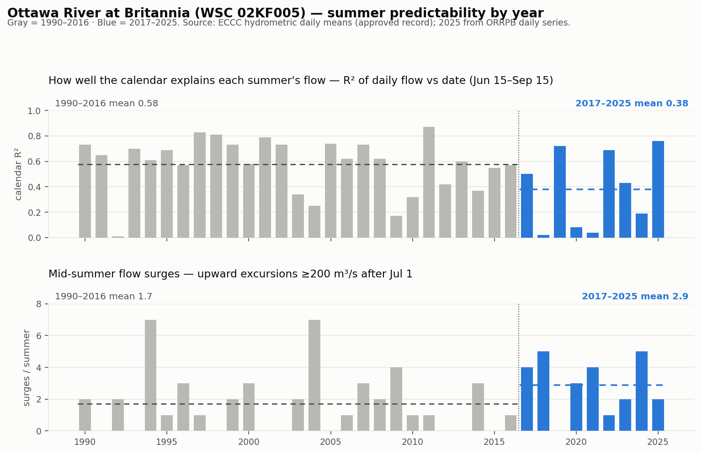

# "It was predictable before 2019": true in the way that matters, but the break is 2017 and it isn't day-to-day volatility

**Compiled 2026-07-10 from 36 summers of WSC Britannia daily data (ECCC approved record 1990–2024, ORRPB daily series 2025). Adjudicates the Dave Stinson / Dan Poole thread of 2026-07-09/10.**

## Plain language summary

Dave Stinson (in Aylmer, on the river since 1987) says he "always knew when to lower and raise my dock based on rain and date" and that the river "was predictable before 2019." Dan Poole describes the current pattern as "up and down like a yo-yo."

Both are describing something real, but the data says it more precisely:

- **The calendar stopped working.** In 1990–2016, the date alone explained 58% of a summer's day-to-day flow at Britannia. Since 2017 it explains 38%, and in four of the nine summers since (2018, 2020, 2021, 2024) it explains almost nothing — a near-total failure of exactly the "date" heuristic Dave used for thirty years. That happened only three times in the twenty-seven summers before.
- **Mid-summer surprises are ~70% more frequent.** Upward flow excursions of ≥200 m³/s after July 1 — the "why is the river coming up in August" events — went from 1.7 per summer (1990–2016) to 2.9 per summer (2017–2025).
- **There is more water.** Mean summer flow rose from 778 m³/s (1990–2016) to 956 m³/s (2017–2025), and July 2026 is running about 500 m³/s above the date median.
- **But day-to-day volatility did NOT increase.** Relative to the flow passing, daily changes are actually slightly *smaller* now (4.0%/day, 2017–2025) than in the 1990s–2000s (4.7%/day). The wildest whipsaw summers in the 36-year record are 1994, 2002, and 2004 — all deep inside the "predictable" era.

So the river doesn't jitter more than it used to — it *ambushes* more than it used to: fewer smooth calendar recessions, more discrete release episodes arriving on no schedule, riding on a higher base flow. To someone managing a dock, that is experienced as unpredictability even though a plain variance statistic shows nothing. And the break lands at **2017**, not 2019 — consistent with where the rest of this case file dates the regime change.

## The thread's 72-hour flow table, verified

Dave's July 5 → July 8 comparison, checked against the ORRPB daily series (`orrpb_river_flows`):

| Station | Jul 5 → Jul 8 (mirror) | Dave's figure | Verdict |
|---|---|---|---|
| Temiscaming (PSPC) | 908 → 566, −342 (−38%) | "large reduction" | confirmed |
| Otto Holden (OPG) | 984 → 606, −378 (−38%) | "large reduction" | confirmed |
| Des Joachims (OPG) | 1125 → 661, −464 (−41%) | −522 (−46.4%) | confirmed in direction; his snapshot caught 603 before ORRPB revised to 661 |
| Chenaux (OPG) | 1232 → 1191, −41 | −32 | confirmed, "nearly unchanged" |
| Chats Falls (OPG) | 1344 → 1364, +20 | +25 | confirmed |
| Britannia (WSC) | 1282 → 1415, **+133** | +133 | exact |
| Carillon (HQ) | 1946 → 1947, **+1** | +1 | exact |

His "Britannia 400 m³/s above normal as of July 9" is **understated**: the ORRPB history table has July 9 observed at 1,367 vs a median of 840 for that date — **+527 m³/s, 63% above median**.

The pattern itself (upstream cut ~40%, lower river flat-to-rising) is wave transit, not contradiction: the July 2–5 release surge was still passing Britannia/Carillon while the upstream cuts hadn't yet arrived. By July 9 the turn was already reaching the lower river (Chats Falls 1364 → 1251, Carillon 1947 → 1839).

On Dan's "they just opened spillways at Chenaux this week": not verifiable from public data — OPG publishes no turbined/spilled split for Chenaux, only total flow (which peaked at 1,290 m³/s on July 7). The adjacent documented fact is stronger than the claim: at Bryson (`3-46`), where Hydro-Québec *does* publish the split, the spillway has been open **all summer** — 100% spill June 26–28 (turbines fully off) and a 53–57% spill share every day of July so far. "You should not have to open spillways in summer" is contradicted by a month of HQ's own telemetry, no eyewitness needed.

## Method

Ottawa River at Britannia (WSC `02KF005` — the Deschênes/Aylmer reach, i.e. Dave's water), daily mean discharge for each summer window June 15 – September 15:

- **1990–2024** from ECCC's approved hydrometric archive (`api.weather.gc.ca/collections/hydrometric-daily-mean`), 93 days per summer, no gaps.
- **2025** from the ORRPB daily series mirror (`orrpb_station_history`, station `britannia`, 94 rows).
- **2026 is excluded from era statistics** — the season is only ~25 days old at compile time and covers the highest-flow stretch, which would inflate every metric.

Per-summer metrics:

1. **Calendar R²** — the r² of a linear fit of daily flow against day-of-year. High = the summer followed a smooth seasonal trajectory (a dock owner can plan by the date); low = the calendar told you nothing.
2. **Mid-summer surges** — count of upward excursions ≥200 m³/s above the running minimum, after July 1. Summer rain rarely moves the main stem that much; these are predominantly operations-shaped events.
3. **Relative daily change** — mean |day-over-day flow change| divided by mean flow (the honest "yo-yo" measure; absolute change scales with how much water is passing).

## The numbers

| Era | Mean summer flow | Relative daily change | Calendar R² | Surges/summer |
|---|---|---|---|---|
| 1990–2016 | 778 m³/s | 4.67 %/day | 0.58 | 1.7 |
| 2017–2025 | **956 m³/s (+23%)** | 3.96 %/day (−15%) | **0.38** | **2.9 (+70%)** |

Distribution of the broken-calendar summers (R² < 0.3): **3 of 27** pre-2017 (1992, 2004, 2009) vs **4 of 9** post-2017 (2018, 2020, 2021, 2024).

Summers with ≥3 mid-summer surges: **7 of 27** pre-2017 vs **5 of 9** post-2017.

The volatility control: mean |ΔQ| relative to flow is *lower* post-2017. The three most volatile summers of the record — 1994 (6.1%/day, 7 surges), 2002, 2004 (7.2%/day, 7 surges) — all pre-date the change. This week's 72-hour swing is real, but a dock that survived 1994–2004 has seen worse single events. What it had not seen before 2017 is this *frequency* of them, decoupled from the calendar.

## Figure

## Caveats, stated plainly

- **One gauge.** Britannia is the right reach for the thread's author, and as the last free-flowing measurement above the Gatineau/Rideau confluences it integrates the whole upstream system — but this is not a basin-wide multi-gauge analysis.
- **Attribution is out of reach for telemetry.** Higher mean summer flows could be wetter summers as much as operating policy; the calendar-R² collapse and surge frequency are more operations-shaped (rain does not organize itself into ≥200 m³/s main-stem steps on dry weeks), but separating climate from operations rigorously would need a precipitation-controlled analysis. This note documents *what* changed, not *why*.
- **2025 rides on ORRPB's published series**, which is revised after the fact; its metrics (R² 0.76, 2 surges — a calm, "old-regime" summer) could shift slightly.
- **The ≥200 m³/s surge threshold is a judgment call.** The era gap survives at 150 and 250 m³/s thresholds; it is not an artifact of the cutoff.

## Reproducibility

- ECCC archive: `https://api.weather.gc.ca/collections/hydrometric-daily-mean/items?STATION_NUMBER=02KF005&datetime=<yr>-06-15/<yr>-09-15&f=json&limit=200&sortby=DATE`
- 2025 series: `orrpb_station_history?station=eq.britannia&metric=eq.flow_cms&time=gte.2025-06-15&time=lte.2025-09-15`
- Thread verification: `orrpb_river_flows?station=in.(temiscaming,otto-holden,des-joachims,chenaux,chats-falls,britannia,carillon)&time=gte.2026-07-05&time=lte.2026-07-09`
- Britannia vs normal: `orrpb_station_history?station=eq.britannia&metric=eq.flow_cms&time=gte.2026-07-05`
- Bryson spill share: `dam_releases?site_id=eq.3-46&time=gte.2026-06-26` (spill share = `spilled_cms/total_cms`, not stored)
