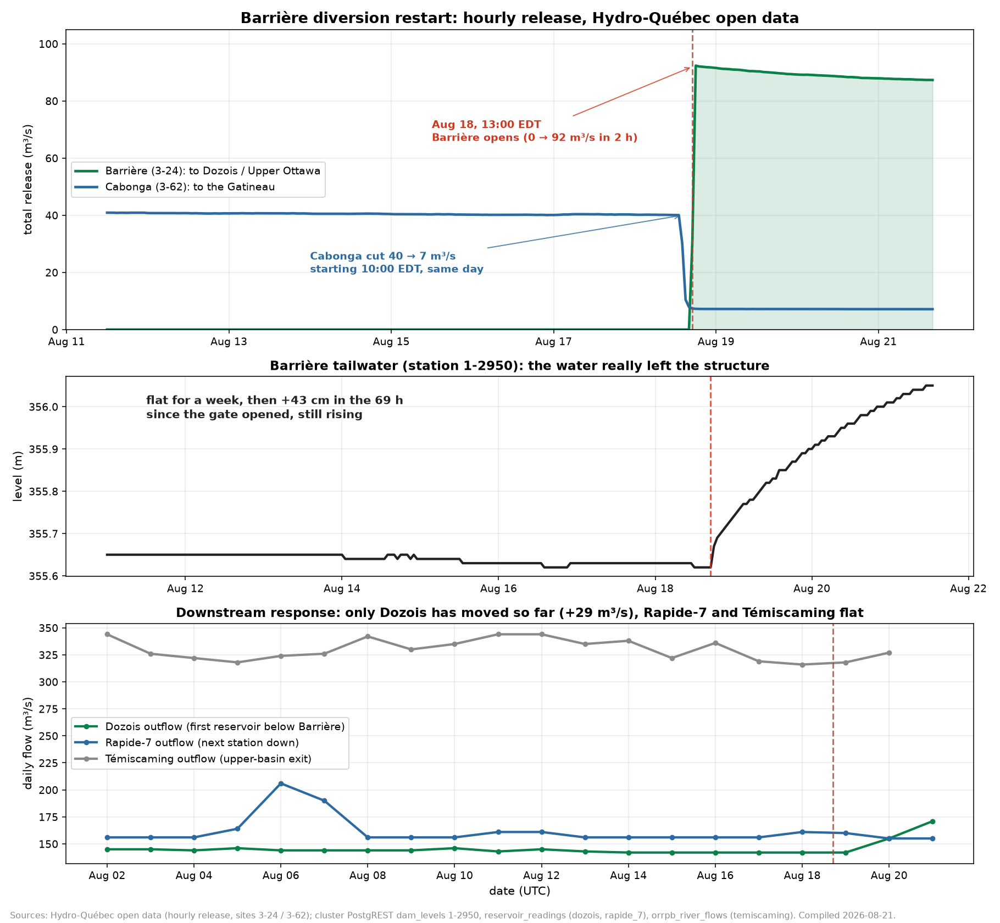

# The Barrière diversion did restart on August 18, and the telemetry confirms it. One number in the graphic needs adjusting.

**Compiled 2026-08-21, in response to the Barrière diversion infographic posted to the Ottawa River Flood Watch page. Every headline claim in the graphic checks out against Hydro-Québec's own hourly open data: the structure opened on the afternoon of August 18, it is passing roughly 88 to 92 cubic metres per second, and that water is going from the Cabonga reservoir into the Dozois system on the Upper Ottawa. The one item worth correcting is the framing that 90 m³/s has been taken away from the Gatineau. Only about 33 m³/s of it was going to the Gatineau. The other 55 or so is additional water being drawn out of Cabonga's storage, and the reservoir's own level gauges confirm it.**

## Plain language summary

On the afternoon of Monday August 18, Hydro-Québec made two moves within three hours of each other at the top of the Cabonga reservoir.

At 10 AM Eastern it began closing the Cabonga dam, the gate at the south-east corner of the reservoir that sends water down into the Gatineau River system. Flow there dropped from about 40 cubic metres per second to about 7 within four hours, and it has sat at 7 ever since.

At 1 PM Eastern it opened the Barrière structure, 28 kilometres away on the north-west side of the same reservoir. That gate had been shut for the entire length of our record. It went from zero to 92 cubic metres per second in two hours, and it has been running between 87 and 92 ever since. Barrière discharges west toward the Dozois reservoir, which is the headwater reservoir of the Ottawa River itself. So this is water leaving the Gatineau watershed and entering the Ottawa watershed, exactly as the graphic says.

We can confirm the water physically left the structure, not just on paper. The gauge immediately below the Barrière dam was flat for a week at 355.62 metres, then started climbing two hours after the gate opened and has risen 43 centimetres since. It is still rising. That is the channel below the dam filling up.

The one thing worth adjusting is the "what this means" panel. It reads as though 90 cubic metres per second that used to feed the Gatineau is now going elsewhere. That is not what the meters say. Only about 33 m³/s came off the Gatineau side. Cabonga's *total* outflow more than doubled, from about 40 to about 96 cubic metres per second, so most of the diverted water is new drawdown of the reservoir. Two independent level gauges on the Cabonga pool back this up: both were falling about half a centimetre a day before August 18, and both are now falling closer to two centimetres a day, which is very close to what the extra 55 m³/s of outflow predicts.

For anyone watching levels on the main stem of the Ottawa, the practical news so far is: nothing has arrived yet. Dozois has passed a little of it along (its outflow is up 29 m³/s), but Rapide-7 immediately below it has not moved, the Quinze chain has not moved, Lake Timiskaming's outflow has not moved, and Lac Coulonge is flat at 105.89 metres, fully normal, about 111 centimetres below pre-alert. The added water is currently sitting in the channel and in Dozois storage. Whether and when it shows up downstream is an operating decision at four more regulated structures, not something the river decides on its own.

## Claim by claim

| Claim in the graphic | Verdict | What the data shows |
|---|---|---|
| Diversion restarted August 18, 2026 | **Confirmed** | Barrière (site 3-24) goes 0.00 at 16:00 UTC to 30.91 at 17:00 UTC to 92.35 at 18:00 UTC on August 18 |
| About 90 m³/s | **Confirmed** | Peak 92.35, mean 88.4 over the first 72 hours, 87.3 at the latest hour |
| Cabonga to Barrière to Dozois to the Abitibi-Témiscamingue section to the Upper Ottawa | **Confirmed** | Barrière sits at 47.497 N, 76.733 W on the Cabonga pool; its tailwater discharges toward the Dozois gauge 26 km west at 47.448 N, 77.076 W |
| Normally Cabonga drains to the Gatineau watershed | **Confirmed** | The Cabonga dam (site 3-62) at 47.310 N, 76.469 W had been passing a steady 40 to 41 m³/s all month toward Baskatong |
| Water that would normally flow into the Gatineau is being redirected | **Overstated by roughly 3x** | Gatineau-side release fell 40.3 to 7.2 m³/s, a loss of 33.1. The remaining 55 m³/s is extra drawdown of Cabonga storage, not water taken from the Gatineau |
| Reduces water entering the Gatineau basin | **Confirmed but small, and not separable downstream** | The 33 m³/s enters Baskatong, which over the same week cut its own outflow from 240 to 152 m³/s for unrelated recession reasons |
| Increases inflows to Dozois and the Upper Ottawa | **Confirmed at Dozois only, so far** | Dozois outflow 142 to 171 m³/s (+29). Rapide-7 flat at 155, Quinze chain flat near 200 to 206, Témiscaming 316 to 327 |
| Diversion window July through February | **Not verifiable from telemetry** | This is a licence and agreement term. Nothing in the public gauge feeds carries it. Cited here as the poster's claim, not as a project finding |
| Maximum 1,080 hm³ | **Not verifiable from telemetry** | Same caveat. If accurate, 88.4 m³/s equals 7.64 hm³ per day, so the cap is 141 days of continuous operation. The first 72 hours used 22.9 hm³, about 2 percent of it |

## The correction, in numbers

Cabonga's outflow, before and after the switch (daily means, Hydro-Québec open data):

| | To the Gatineau (Cabonga, 3-62) | To the Upper Ottawa (Barrière, 3-24) | Total leaving the reservoir |
|---|---|---|---|
| August 17 | 40.3 m³/s | 0.0 | **40.3 m³/s** |
| August 20 | 7.2 m³/s | 88.6 | **95.8 m³/s** |
| Change | **−33.1** | **+88.6** | **+55.5** |

So the diversion is not a rerouting of an existing 90 m³/s. It is a 33 m³/s reduction on the Gatineau side plus 55 m³/s of new release from storage.

**The mass balance confirms it.** Using the reservoir band the dashboard carries for Cabonga (356.16 to 360.88 m, 1,565 hm³ of usable storage, so roughly 332 hm³ per metre of level), an extra 55.5 m³/s equals 4.80 hm³ per day, which should pull the pool down about 1.45 cm per day faster than before. Both gauges on the Cabonga pool agree, measured at 13:00 UTC to avoid diurnal noise:

| Gauge | Aug 8 to Aug 18 | Aug 18 to Aug 21 | Predicted after Aug 18 |
|---|---|---|---|
| Barrière amont (1-2942), at the intake | 360.06 to 360.01, **−0.50 cm/day** | 360.01 to 359.95, **−2.0 cm/day** | −1.95 cm/day |
| Cabonga amont (1-2944), 28 km away | 360.18 to 360.13, **−0.50 cm/day** | 360.13 to 360.08, **−1.67 cm/day** | −1.95 cm/day |

A roughly four-fold acceleration in the drawdown rate at both gauges, landing within a few millimetres a day of the predicted figure at the intake gauge. That is about as clean a confirmation as this telemetry allows, and it is why the "taken from the Gatineau" framing needs adjusting: the river below Cabonga only lost 33.

The intake gauge is also running slightly ahead of the far gauge (the gap widened from 13 cm on August 17 to 15 cm on August 21), which is the local drawdown you would expect near a newly opened intake on a reservoir this large.

## Where the water actually is

Roughly 23 hm³ has passed through Barrière in the first 72 hours. Very little of it has reached the main stem:

- **Barrière tailwater** is up 43 cm and still climbing. Channel storage.
- **Dozois** outflow rose from a flat 142 m³/s to 155 then 171, so about +29 of the +88 is being passed along. Its level is still falling at 2 to 3 cm per day, the same rate as before the diversion, so Dozois is not yet refilling either. It is 343.67 m, about 2.28 m below the top of its band and 1.86 m below its May peak.
- **Rapide-7**, the next structure down, is flat to slightly falling (155.4 to 154.9 m³/s), and its own pool is unchanged at 308.91 m.
- **Rapides-des-Îles, Rapides-des-Quinze and Première-Chute** are all flat near 200 to 206 m³/s.
- **Témiscaming** finalized August 20 at 327 m³/s, inside the range it has held all month, and still in its long streak below 400.
- **Lac Coulonge** is 105.89 m, unchanged for two days, etat 0, about 111 cm below the 107.00 m pre-alert threshold.

Two to three days is not long enough for a headwater change to route down five structures, and every one of those structures has storage and an operator. Nobody should read this as an incoming rise at the property reach. What it does change is the storage picture: Hydro-Québec is moving water out of a near-full reservoir (Cabonga sits about 84 percent up its band and has barely moved since June) into a headwater reservoir that has been drawing down all summer (Dozois is about 75 percent up its band and down 1.86 m from its May peak). Read as a refill posture on the Ottawa headwaters ahead of fall and winter, that is a coherent operating story, and it is consistent with the July-to-February window the graphic cites.

## What we cannot say

- **Why.** The telemetry shows the switch, not the reasoning. Refill of Dozois, generation scheduling on the Upper Ottawa cascade, and Gatineau-side management are all consistent with what is on the meters. We cannot separate them.
- **The authorization terms.** The July-to-February window and the 1,080 hm³ ceiling are not in any gauge feed. They are reproduced above as the poster's claim. If someone can point at the licence or the agreement text, the case file will cite it properly.
- **How long it runs.** At the current rate, storage is not the constraint (Cabonga has about 3.9 m to the bottom of its band, roughly 218 days at the present net drawdown). If the 1,080 hm³ figure is right, the annual cap is the binding constraint and would be reached in early January.

## Two things this exposed in our own stack

The graphic beat our own automated brief to this story by three days, and that is worth writing down rather than glossing over.

1. **The cluster's release ingest missed the first 17 hours.** `dam_releases` for site 3-24 still carries `total_cms = 0` for every hour from 2026-08-18T00:00Z through 2026-08-19T09:00Z, while Hydro-Québec's live feed now publishes 30.91 at 17:00Z and 92.35 at 18:00Z on August 18. The ingester read those hours before Hydro-Québec back-filled them and never re-read them. Anyone querying the cluster alone would date the restart to 06:00 EDT on August 19, about 17 hours late, and would report an August 19 daily mean of 52.5 m³/s instead of the true 90.4. Every number in this note that touches the opening hours comes from the primary feed for that reason. The fix is a re-read window on the hq-ingest cron rather than append-only insertion.
2. **The daily brief has no watch on this structure.** The August 19 and August 20 briefs both carried Cabonga and Dozois in the reservoir table and reported them as "Steady, −1 cm" and "Falling, −2 cm", which was accurate and completely uninformative. The brief's release watch list is the Ottawa main-stem cascade plus Bryson. Barrière (3-24) and Cabonga (3-62) are not on it, so a zero-to-92 step at a diversion structure produced no flag at all. Adding both sites to the release watch list, with an any-nonzero alarm on 3-24 specifically, would have caught this the same evening.

## Addendum, same day: Dan's follow-up comment

Later on August 21, Dan posted a narrative companion to the infographic on the same thread. It is a good summary and most of it needs no correction. Adjudicating the parts the first pass did not cover:

- **"Inactive since February": plausible, not verifiable from our record.** Our Barrière telemetry starts 2026-04-22 and reads zero continuously until August 18, which is consistent with a February shutdown, and a February stop is exactly what the July-to-February authorization window predicts for the prior season. But no public feed we hold reaches back that far, so this stays Dan's claim rather than a data point.
- **"Redirected eastward": the direction is westward.** Barrière sits on the northwest corner of the Cabonga pool (47.50 N, 76.73 W) and discharges toward Dozois, whose gauge is further west at 77.08 W. East from Cabonga is the Gatineau side, the direction the water stopped going.
- **"Significantly more generating stations than the Gatineau": confirmed.** The Gatineau below Baskatong has four HQ stations (Mercier, Paugan, Chelsea, Rapides-Farmers). The diverted water's route has five HQ stations before Lake Timiskaming alone (Rapide-7, Rapide-2, Rapides-des-Quinze, Rapides-des-Îles, Première-Chute), then the OPG plants (Otto Holden, Des Joachims, Chenaux, Chats Falls) plus Bryson, Carillon and the rest of the main stem below the lake.
- **"A portion of that water is being redirected": Dan's phrasing is more careful than the infographic's** and closer to what the meters show. The portion that was actually Gatineau-bound is about a third (33 of 90 m³/s); the rest is new drawdown of Cabonga storage, per the mass balance above.
- **"Flows remained relatively stable since": confirmed.** 92.4 m³/s at the opening, easing gently to 87.4 by August 21, a drift of about 5 percent over three days.

## Source and methodology

- **Hourly release, Barrière (3-24) and Cabonga (3-62):** Hydro-Québec open data, `Donnees_VUE_CENTRALES_ET_OUVRAGES.json`, retrieved 2026-08-21T16:00Z. This is the primary source and is authoritative over the cluster mirror for the August 18 opening hours, per the ingest gap described above.
- **Barrière tailwater (1-2950), Barrière amont (1-2942), Cabonga amont (1-2944):** cluster PostgREST `dam_levels`, hourly, retrieved 2026-08-21.
- **Dozois, Cabonga, Baskatong and Rapide-7 levels and outflows:** `reservoir_readings`, midnight series, current to 2026-08-21T00:00Z. Agency HQ as recorded per row.
- **Témiscaming outflow:** `orrpb_river_flows?station=eq.temiscaming`, agency PSPC, through August 20. The August 21 value was not yet published at the time of writing and is not cited.
- **Upper cascade releases (3-28, 3-29, 3-31, 3-32, 3-33) and Gatineau cascade (3-63, 3-65, 3-66, 3-67):** `dam_releases`, hourly, aggregated to daily means.
- **Lac Coulonge:** `orrpb_river_levels` midnight series, station lake-coulonge, 105.89 m on 2026-08-21.
- **Site coordinates:** `dam_sites`.
- **Reservoir bands and usable storage:** `dashboard/reservoir-limits.json`, calibrated from the ORRPB ICOLD-Canada case study (Table 1, 2020). The storage-per-metre figure used in the mass balance treats the band as level-linear, which is an approximation; it is adequate for a factor-of-four rate change but should not be read as a precise volume.
- **Figure:** `ingesters/climate-history/barriere_diversion_restart.py`, output `figures/2026-08-21_barriere_diversion_restart.png`.
- Per ORRPB's terms, this note presents derived statistics (daily means, deltas, drawdown rates, implied volumes) rather than reproducing the published tables, and cites ORRPB as the source where its data is used.
- **Record depth caveat:** the project's `dam_releases` history for site 3-24 begins 2026-04-22T15:00Z. Barrière read zero for every hour from then until 2026-08-18T17:00Z, so "restarted" is accurate within our record, which is 119 days deep. We have no data on prior diversion seasons and make no claim about them.

## Related case-file material

- [Mid-valley surge correction](2026-08-06_mid_valley_surge_correction.md): the provisional-flow guardrail that this note follows, and the reason every opening-hour figure here was cross-checked against the primary feed before being written down
- [Des Joachims summer cycling](2026-07-23_des_joachims_cycling.md): the closest precedent for adjudicating a community infographic against hourly telemetry
- [Daily brief 2026-08-20](../daily-briefs/2026-08-20.md): the brief that had Cabonga and Dozois in its reservoir table and did not notice
