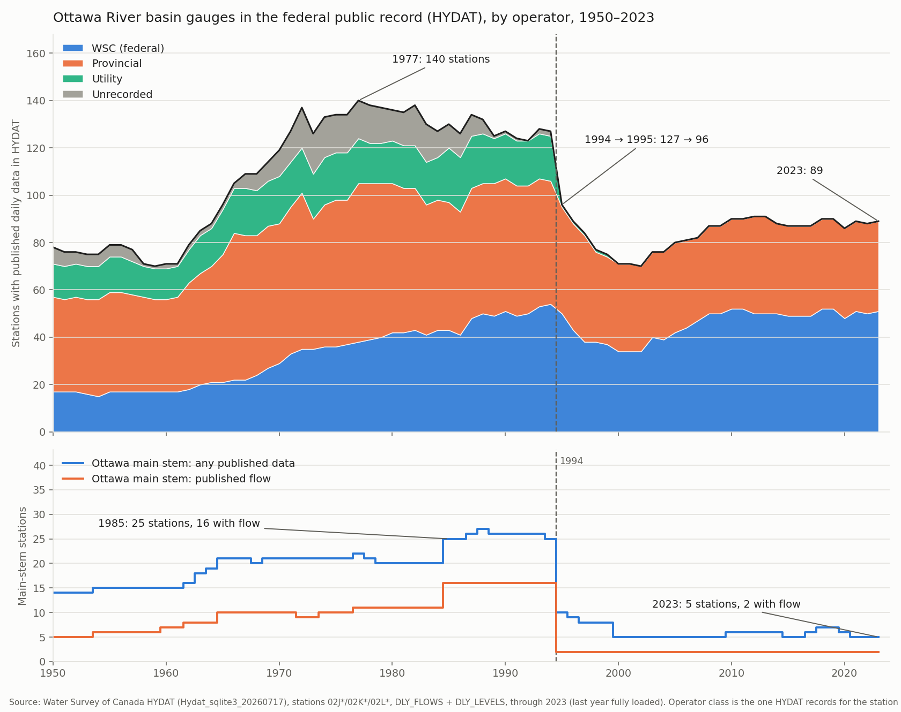

# Dan is right about 1994: the federal public record for the Ottawa basin lost a quarter of its gauges in one year, and the main stem lost nearly all of its flow stations. One detail needs adjusting: the pre-1994 records are still there. It is the years after 1994 that have to be reconstructed.

**Compiled 2026-08-25, in response to Dan's comment on the Ottawa River Flood Watch page ("We need more hydrometers in the Ottawa River basin, not less"). We checked every claim in it against the Water Survey of Canada's own archive, HYDAT, for all 289 stations that have ever existed in the basin. Every factual claim holds. The count of basin gauges with published daily data in the federal archive peaked at 140 in 1977, sat at 127 in 1994, and fell to 96 in 1995, the largest one-year drop in the record. The stations that vanished were almost entirely the ones at dams and generating stations, on both sides of the river: 16 Hydro-Québec sites in Quebec and 9 Ontario Hydro sites in Ontario. On the Ottawa main stem itself, the federal archive carried 16 flow stations in 1994 and has carried 2 ever since. The one adjustment: the pre-1994 records were not lost and do not need reconstructing. They are still in HYDAT today. What has to be stitched together from Hydro-Québec, OPG and provincial sources is everything from 1995 onward.**

## Plain language summary

Water Survey of Canada does not measure every gauge it publishes. For most of the last century the federal archive, HYDAT, has been a shared record: some stations are run by WSC itself, some by provincial agencies (Quebec's environment ministry, Ontario's), and some by the dam operators, who read the flow through their own plants and handed the numbers to WSC to publish. In the Ottawa basin, the operator-fed stations were the important ones for flood work, because they sat at the dams: Dozois, Rapide-7, Rapide-2, the Quinze chain, Des Joachims, Bryson, Chats Falls, Hull, Carillon, and the Gatineau plants.

In 1994 that arrangement ended. Nineteen operator-measured stations were publishing in the federal archive in 1994. One was publishing in 1995. Ontario Hydro's stations carry the same note in HYDAT to this day: "After 1994, data available from Ontario Hydro." Hydro-Québec's carry no note at all; their records simply stop.

The rest of the network shrank more slowly over the following years, bottoming out at 70 stations in 2002, and has since partially recovered on the Ontario side to about 89 stations basin-wide. But the recovery is in small tributary gauges. On the main stem of the Ottawa, from the Dozois reservoir to Carillon, the federal archive had 25 stations in 1985 (16 of them measuring flow) and has 5 today, of which exactly 2 measure flow: Britannia in Ottawa, and a headwater station at the outlet of Lac Granet above Dozois. Every other flow figure the public sees for the main stem now comes from an operator or a board (Hydro-Québec's open-data feed, OPG via the Ottawa River Regulation Planning Board, Quebec's Vigilance service), each with its own format, retention window and revision policy. That is the decentralization Dan is describing, and it is exactly the shape of the data stack this project had to build.

The point worth adjusting is about which years are hard to get. The pre-1994 records at these stations were never removed from HYDAT. Des Joachims 1950 to 1994, Chats Falls 1915 to 1994, Carillon 1962 to 1994, Bryson 1985 to 1994: all of it is one download today. The reconstruction problem is the other side of the line. For 1995 to 2026 there is no federal archive at any of these sites, Hydro-Québec's public feed keeps about ten days, OPG publishes nothing directly, and the ORRPB series are the only continuous public record. Building a long-term inflow series means splicing a finalized federal record onto a provisional operator record at 1994, which is doable but is not the same thing as having one series.

## Claim by claim

| Claim in the comment | Verdict | What HYDAT shows |
|---|---|---|
| A noticeable reduction in federal/public WSC gauge records in the Ottawa basin, especially around 1994 | **Confirmed** | 127 stations with published daily data in 1994, 96 in 1995. A 24 percent drop in one year, the largest in the 1950 to 2023 record. 31 stations published their last year of data in 1994 |
| Many stations were transferred to provincial or utility responsibility | **Confirmed, with a wording adjustment** | 25 of the 31 stations that ended in 1994 were operator-measured dam and plant stations. They were not transferred to the utilities; the utilities had always measured them (HYDAT's measurement code is "Power Plant"). What ended was the utilities' contribution of those records to the federal archive |
| Particularly in Quebec | **Confirmed for the long run, even-handed in 1994** | The 1994 cut hit both sides: 16 Hydro-Québec stations in Quebec and 9 Ontario Hydro stations in Ontario. Over the longer run Quebec's loss is much larger: 81 Quebec stations in HYDAT at the 1977 peak, 41 in 2023 (down 49 percent), against 59 to 48 in Ontario (down 19 percent). Quebec's provincial network largely stopped feeding HYDAT and publishes through CEHQ instead; 43 Quebec stations carry a HYDAT remark pointing to the CEHQ website |
| The river is still monitored extensively today | **Confirmed** | 97 basin stations carry active status in HYDAT (51 Ontario, 46 Quebec), 89 published data in 2023, and the operators' own feeds cover the dams. Our own tier ingests 22 Hydro-Québec release sites and 77 Hydro-Québec level stations, the ORRPB series and Vigilance on top of the WSC realtime feed |
| The system is more decentralized than in the 1970s and 1980s | **Confirmed and quantified** | In 1985 one archive held 130 basin stations including 16 main-stem flow stations and 23 operator-fed sites. Today the federal archive holds 89 stations, 2 of them main-stem flow, and 0 operator-fed. The rest is spread across Hydro-Québec open data, ORRPB, CEHQ/Vigilance and OPG |
| Some pre-1994 flow records once easy to access through WSC may now require HQ, OPG or provincial sources to reconstruct | **Needs adjusting: it is the post-1994 records** | Every pre-1994 record at the discontinued stations is still in HYDAT and downloadable. The gap is 1995 onward, where the only sources are the operators and ORRPB. Long-term inflow reconstruction means splicing at 1994, not recovering the earlier years |
| We need more hydrometers, not fewer | Opinion, and the case file agrees | The Westmeath stage gauge (02KC005, 1935 to 1995) is one of the 1995 to 2000 main-stem casualties, and its reinstatement is a standing ask in this case file |

## The numbers

Stations in the Ottawa basin (HYDAT prefixes 02J, 02K, 02L) with at least one day of published daily flow or level in the year, by the operator class HYDAT records for the station:

| Year | All | Ontario | Quebec | With flow | WSC-operated | Provincial | Utility (operator-measured) | Main stem, any | Main stem, flow |
|---|---|---|---|---|---|---|---|---|---|
| 1970 | 119 | 44 | 75 | 89 | 29 | 59 | 20 | 21 | 10 |
| 1977 (peak) | **140** | 59 | 81 | 91 | 38 | 67 | 19 | 22 | 11 |
| 1985 | 130 | 59 | 71 | 93 | 43 | 54 | 23 | 25 | 16 |
| 1990 | 127 | 55 | 72 | 86 | 51 | 56 | 19 | 26 | 16 |
| 1994 | 127 | 58 | 69 | 84 | 54 | 52 | 19 | 25 | 16 |
| 1995 | **96** | 43 | 53 | 59 | 50 | 45 | **1** | **10** | **2** |
| 1996 | 89 | 36 | 53 | 53 | 43 | 45 | 1 | 9 | 2 |
| 2000 | 71 | 29 | 42 | 42 | 34 | 37 | 0 | 5 | 2 |
| 2002 (trough) | 70 | 29 | 41 | 41 | 34 | 36 | 0 | 5 | 2 |
| 2010 | 90 | 46 | 44 | 54 | 52 | 38 | 0 | 6 | 2 |
| 2020 | 86 | 45 | 41 | 56 | 48 | 38 | 0 | 6 | 2 |
| 2023 | 89 | 48 | 41 | 56 | 51 | 38 | 0 | 5 | 2 |

2023 is the last year HYDAT has fully loaded; 2024 and 2025 are still filling in (Quebec flow stations read 12 for 2024 against 21 for 2023, which is publication lag, not closures), so they are excluded from the figure and the table.

**Peak to present:** 140 to 89 stations (down 36 percent), 91 to 56 flow stations (down 38 percent). The federally operated count is actually higher today than at the peak (38 to 51, all of the growth in Ontario). The entire net loss is provincial and utility contributions.

### The 1994 cohort

31 stations published their last year of data in 1994. Twenty-five are dam or plant stations:

- **Quebec, Hydro-Québec (16):** Dozois reservoir outflow, Rapide-7, Rapide-2, Rapides-des-Quinze (dam and centrale), Rapides-des-Îles (dam and centrale), Première-Chute, Bryson, Hull 2, Carillon, Cabonga (dam outflow and reservoir level), Baskatong reservoir level, Paugan, Rapides-Farmers.
- **Ontario, Ontario Hydro (9):** Lower Notch and Mistinikon Lake on the Montreal River, La Cave Rapids, Rabbit Lake dam, Des Joachims, Sandpoint (level), Bark Lake dam and Stewartville on the Madawaska, Chats Falls.
- **The other six** are small WSC or unattributed stations in the South Nation and Prescott area (East Branch Scotch River, Black Creek, Bear Brook, Sequin Bridge, Casselman, Lemieux), which is ordinary tributary-network churn.

All nine Ontario Hydro stations in the cohort carry the HYDAT remark "AFTER 1994, DATA AVAILABLE FROM ONTARIO HYDRO" (eleven basin stations carry it in total). None of the Hydro-Québec stations carry any remark.

### The main stem, before and after

Main-stem stations (station name beginning "Ottawa River" or "Outaouais") with published data:

| | 1985 | 2023 |
|---|---|---|
| Flow | 16: Dozois, Rapide-7, Rapide-2, Quinze dam, Quinze centrale, Lac Granet outlet, Îles dam, Îles centrale, Première-Chute, La Cave, Des Joachims, Bryson, Britannia, Chats Falls, Hull 2, Carillon | 2: Britannia, Lac Granet outlet |
| Level only | 9: Mattawa, Westmeath, Arnprior, Pembroke, Hull, Grenville, Cumberland, Carillon amont, Carillon aval | 3: Mattawa, Thorne, Hull |

The level network thinned in a second wave after the 1994 flow cut: Westmeath ended 1995, Cumberland 1996, Grenville 1999, both Carillon level stations 2000. Thorne (2017) is the only main-stem addition in thirty years. Below Lake Timiskaming, the one public flow record in the federal archive for the last 29 years is Britannia.

### Where the discontinued stations' data lives now

This is the decentralization in concrete terms, mapped onto the sources this project ingests:

| Former HYDAT station | Where the post-1994 record is | Public retention |
|---|---|---|
| Rapide-7, Rapide-2, Quinze, Îles, Première-Chute, Bryson, Carillon, Paugan, Rapides-Farmers, Cabonga | Hydro-Québec open data (`dam_releases`, sites 3-28, 3-29, 3-31, 3-32, 3-33, 3-46, 3-60, 3-65, 3-67, 3-62) | About ten days rolling. No public archive. The cluster keeps what it has ingested since April 2026 |
| Des Joachims, Chats Falls (and Chenaux, Otto Holden, never in HYDAT) | OPG, via ORRPB's published daily series (`orrpb_river_flows`) | ORRPB publishes; OPG has no public archive of its own. Latest day is provisional |
| Dozois reservoir, Baskatong, Cabonga levels | ORRPB reservoir tables (`reservoir_readings`) | Same |
| Quebec provincial stations (Coulonge at Fort-Coulonge ended 1996, Maniwaki 1998, and others) | CEHQ / Vigilance (`river_readings`, e.g. Lac Coulonge 1195) | Level only at Lac Coulonge. No flow |
| Pembroke, Sandpoint, Westmeath, Arnprior levels | ORRPB level series, or nothing | Westmeath: nothing |

## What we cannot say

- **Why 1994.** HYDAT records the stop, not the reason. The timing coincides with the federal Program Review era (the case file's Canada/US comparison cites Pilon et al. 1996 on a national 5 percent network contraction over 1990 to 1996), and with the end of the utilities' data-sharing arrangements, but the archive does not say which agreements lapsed or who declined to renew. Treat the cause as background, not as a finding.
- **Whether the operators still hold complete records.** "Data available from Ontario Hydro" is a 1994 remark. Whether OPG can produce a continuous daily series for Des Joachims 1995 to 2026 on request is unknown; nobody in this thread has asked.
- **Operator class is a point-in-time field.** HYDAT stores one operator per station, the current or last one. A station that changed hands mid-record is counted under its last operator for its whole life. This affects the split between the coloured bands in the figure, not the total.

## Source and methodology

- **Archive:** Water Survey of Canada HYDAT, `Hydat_sqlite3_20260717.zip` (published 2026-07-17), tables `STATIONS`, `AGENCY_LIST`, `DLY_FLOWS`, `DLY_LEVELS`, `STN_REMARKS`. Open Government Licence, Canada.
- **Basin:** all 289 stations with prefixes `02J` (upper Ottawa: Dozois to Lake Timiskaming, Kipawa, Montreal River, Mattawa), `02K` (middle Ottawa and Ontario tributaries) and `02L` (Rideau, Gatineau, Lièvre, lower Ottawa). This closes the follow-up flagged in the Canada/US comparison note, which had only scanned 02K and 02L.
- **Counting rule:** a station counts in a year if it has at least one row in `DLY_FLOWS` or `DLY_LEVELS` for that year. This is stricter than the station's nominal operating period and reflects what is actually downloadable.
- **Operator class:** WSC = operator name begins "Water Survey"; Provincial = Quebec or Ontario environment ministry; Utility = Hydro-Québec, Ontario Power Generation, MacLaren, Pembroke Electric; Unrecorded = no operator on file (mostly pre-1990 Ontario stations).
- **Script:** `ingesters/climate-history/wsc_station_count_history.py`. Output table `data/wsc-hydrometric/ottawa-basin-station-counts.csv`, figure `figures/2026-08-25_wsc_station_count_1994.png`. The per-station inventory it complements (02K and 02L only, 223 stations, from the April 2026 HYDAT) is `data/wsc-hydrometric/ottawa-basin-stations.csv`.
- **A note on Bryson:** HYDAT's station record says Bryson was measured from 1925, but the daily table only holds 1985 to 1994. The earlier years, if they exist, are with Hydro-Québec.

## Related case-file material

- [Canada vs US hydrometric monitoring](../../docs/analysis/Canada_US_Hydrometric_Comparison.md): the structural background (funding model, disclosure law, the Westmeath argument), which flagged this basin-wide scan as the missing piece
- [WSC hydrometric extract README](../wsc-hydrometric/README.md): the seven-station daily extract and the original note on the 1994 coverage gap at Bryson and Chats Falls
- [Barrière diversion restart](2026-08-21_barriere_diversion_restart.md): the previous adjudication of a Dan comment, and an example of the ten-day Hydro-Québec window costing the project 17 hours of record
- [Mid-valley surge correction](2026-08-06_mid_valley_surge_correction.md): what "provisional operator record" means in practice
