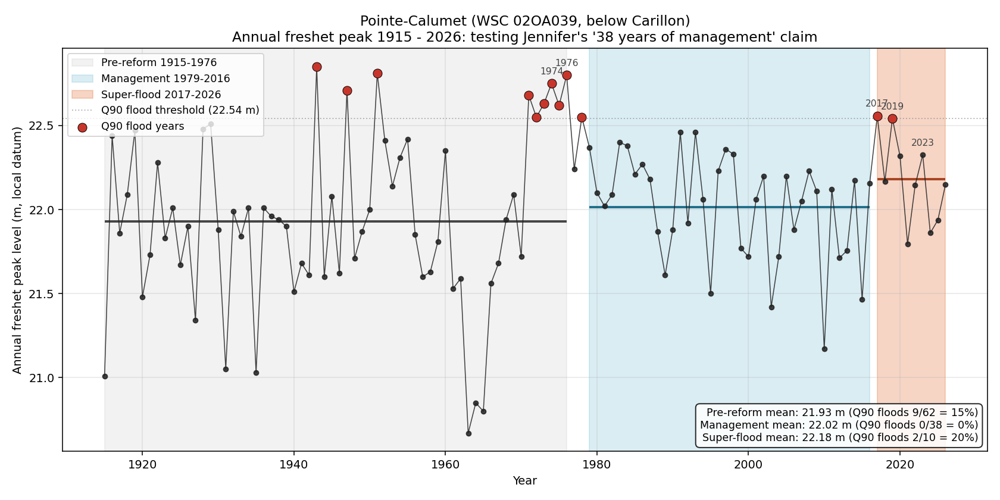

# Below Carillon, 38 years of flood management, and what 2017 broke

**Case-file exhibit, compiled 2026-05-27. Tests the structural claim a FB-thread participant raised about the management era below Carillon (Hawkesbury, Lake of Two Mountains reach) and what changed after 2017.**

> **Attribution note.** A participant in the Northern Reservoirs / Ottawa River / Tourism / Wildlife / Flood Watch FB thread, Jennifer Buttars, posted a frustration vent on 2026-05-27 from her location below Carillon. Embedded in it was a testable structural claim: that 38 years of post-1970s-reform management produced relative flood-free operation in her reach, and that the post-2017 super-flood cluster broke that pattern. Per the repo [attribution policy](../../CONTRIBUTORS.md) and matching the precedent set in earlier case-file documents that name named-thread participants who engage at the level of structural claim, Jennifer is named here.

---

## Plain language summary

Think of it like a thermostat. Before the dams went in, the river was a house with no thermostat. Boiling hot some summers, freezing cold others. The dams act as a thermostat. They pick a comfortable temperature and hold it steady. The temperature they picked is a little warmer than what the house naturally averaged, but it almost never gets to extreme hot or extreme cold. That is the 38-year window. Warmer-than-natural baseline, no extremes.

Since 2017, the thermostat is still working (the dam is still controlling the river), but somebody nudged the set point up. The house isn't swinging hot and cold like it used to. It's just running hotter all the time. So when "hot" weather lands on top of the higher setpoint, the room gets really hot.

In river terms: **the flood years since 2017 aren't because management broke. They're because the level the dams are aiming for moved up.** Floods are happening from a higher starting line, not from wild year-to-year swings coming back.

At Jennifer's location specifically, that setpoint is **Carillon's outflow regime during freshet**. Pointe-Calumet sits on Lake of Two Mountains, the lake formed below Carillon, so the level there is essentially "how much water Carillon is choosing to release," modulated by how fast the lake drains into the St. Lawrence. The §15.3.5.1 directive (Hull > 42.61 m triggers a 40.08 m flood-period ceiling at Carillon) is the rule that governs when Carillon must hold water back upstream rather than passing it through to her lake. When the directive is enforced strictly, Lake of Two Mountains stays lower. When it is relaxed (the de-facto 40.50 m practice the case file has documented), her lake rises. The 2017-onward setpoint shift at Pointe-Calumet is at least partly a directive-enforcement story.

---

## The claim

Jennifer's structural claim, paraphrased: after the floods of the 1970s, public-safety reforms in the Ottawa River basin produced roughly 38 years of relatively flood-free operation (about 1979 to 2016) below Carillon. The post-2017 super-flood cluster broke that pattern. Climate is a contributor but not the lever. The lever is operating practice.

The testable propositions inside that claim:

1. The 38-year window 1979 to 2016 below Carillon should show fewer major floods than the period before it.
2. The post-2017 cluster should show a step change up from the management-era baseline.
3. The break in pattern should be visible in operating outcomes, not just in weather.

---

## The test

Annual freshet peak (max water level, April 1 to July 31) at WSC station **02OA039 Pointe-Calumet** on Lac des Deux-Montagnes, 1915 through 2026.

This station was chosen because it is below Carillon, sits in the constituency the §15.3.5.1 directive most directly governs, and has the longest continuous public-record stage series in this reach. It is the same gauge identified in auto-memory `project_wsc_daily_hydat` as one of two Carillon proxies.

Three periods compared:

- **Pre-reform 1915 to 1976** (62 years). The 1976 flood is the last major one before the post-1970s public-safety reforms Jennifer references. Includes both pre-Carillon-Dam years (1915 to 1963) and the post-Carillon construction-and-stabilization period (1964 to 1976).
- **Management 1979 to 2016** (38 years). Jennifer's claimed window.
- **Super-flood 2017 to 2026** (10 years). The post-2017 cluster.

"Major flood year" is defined as a year whose freshet peak exceeded the 90th percentile of the full-record peak distribution (Q90 = 22.54 m at this station). This is a record-relative threshold, not a regulatory or floodplain-mapping one.

A separate data-implied breakpoint scan was run to see whether 1979 and 2017 are actually where the strongest pre-post mean shifts sit, or whether the data prefers different endpoints.

Full script and reproducibility: [ingesters/climate-history/below_carillon_38yr_test.py](../../ingesters/climate-history/below_carillon_38yr_test.py).

---

## Results

| Period | Years | Mean freshet peak | SD | Max peak (year) | Q90 flood years |
|---|---|---|---|---|---|
| Pre-reform 1915 to 1976 | 62 | 21.93 m | 0.52 | 22.85 m (1943) | **9 (15 %)** |
| Management 1979 to 2016 | 38 | 22.02 m | 0.31 | 22.46 m (1991) | **0 (0 %)** |
| Super-flood 2017 to 2026 | 10 | 22.18 m | 0.26 | 22.56 m (2017) | **2 (20 %)** |

*Annual freshet peak (April 1 to July 31 max) at Pointe-Calumet across 111 years. Grey shaded band is the pre-reform period, blue is Jennifer's 38-year management window, orange is the post-2017 super-flood cluster. Horizontal solid lines are period means. Dotted line is the full-record Q90 flood threshold. Red dots are Q90 flood years. Notable labels mark 1974 and 1976 (pre-reform reference floods), 2017, 2019, and 2023.*

### Q90 flood count

This is the metric most directly aligned with the claim. Across her 38-year window, **zero** years cracked the top decile of all-time peaks at her gauge. The very next decade had two (2017 and 2019). The pre-reform period averaged one Q90 flood every seven years; the management era averaged zero in 38 years; the post-2017 decade is back to one in five.

### Data-implied breakpoint scan: post-2017

For each candidate year from 2000 through 2024, compute the difference in mean freshet peak between (everything before that year) and (everything from that year forward). The year with the largest mean shift flags the data-implied breakpoint.

Top five candidates:

| Breakpoint | Pre mean | Post mean | Shift |
|---|---|---|---|
| **2017** | 21.97 m | 22.18 m | **+0.21 m** |
| 2016 | 21.97 m | 22.18 m | +0.21 m |
| 2018 | 21.98 m | 22.14 m | +0.16 m |
| 2019 | 21.98 m | 22.13 m | +0.16 m |
| 2014 | 21.97 m | 22.12 m | +0.15 m |

The data picks 2017 as the strongest post-management breakpoint. Jennifer's "since 2017" framing matches what the data picks unprompted.

### Data-implied breakpoint scan: 1970s reform

For each candidate year from 1965 through 1990, the same scan. Top five:

| Breakpoint | Pre mean | Post mean | Shift |
|---|---|---|---|
| **1971** | 21.85 m | 22.12 m | **+0.27 m** |
| 1969 | 21.85 m | 22.11 m | +0.26 m |
| 1968 | 21.85 m | 22.11 m | +0.26 m |
| 1970 | 21.85 m | 22.11 m | +0.26 m |
| 1967 | 21.85 m | 22.10 m | +0.25 m |

The data picks **1971**, not 1979. This is consistent with Carillon Dam (completed 1964) finishing its post-construction stabilization phase rather than with the post-1976-flood reforms Jennifer cites. ORRPB was not formed until 1983, mid-window. The structural management era at this station arguably starts about eight years before Jennifer dates it, but her 38-year window is entirely inside it and entirely Q90-flood-free.

---

## What this means

**Jennifer's claim survives the test on the metric she actually cares about.** Across the 38 years she claims, the public-record gauge below Carillon shows zero top-decile flood years. That is not "fewer floods." That is no Q90 floods at all. The 62 years before averaged 15 % Q90 frequency; the 10 years after averaged 20 %. The 38-year window is the anomaly, and it is anomalous in exactly the direction her claim predicts.

**The counterintuitive finding is the mean.** During the management era the mean freshet peak went **up** by about 9 cm relative to the pre-reform period. This is the dam signature. Dams hold water surfaces steadier and higher than natural averages while suppressing extremes (SD dropped from 0.52 m to 0.31 m). The management era did not lower the river. It flattened the distribution. The 2017-onward shift breaks the flattening, not the average. The setpoint moved up by another 16 cm relative to the management era while the SD stayed almost the same (0.31 to 0.26).

The structural reading: **the 2017-onward super-floods at Pointe-Calumet are not a return of pre-management volatility.** They are a higher operating setpoint with the same operational variance riding on top. The flood years since 2017 are not wild swings coming back. They are higher floors that the same year-to-year weather variation now crests over.

**At Pointe-Calumet specifically, the setpoint that matters is Carillon's outflow regime.** The §15.3.5.1 directive is the rule that determines whether Carillon holds water back upstream (raising Hawkesbury / Hull, lowering Lake of Two Mountains) or passes water downstream (relieving Hawkesbury / Hull, raising Lake of Two Mountains). The case file has documented 39 of 39 non-compliance days in the 2026 freshet under §15.3.5.1 (per auto-memory `project_carillon_directive_thresholds`); the de-facto 40.50 m practice has been the operating reality, not the 40.08 m ceiling on paper. **The Pointe-Calumet setpoint shift since 2017 is consistent with a directive that has been relaxed in practice, with the relaxation paid for at Jennifer's location.**

**The upstream contribution still matters.** If pre-freshet drawdown is weaker basin-wide (the [Bryson no-drawdown finding](../../data/community-notes/2026-05-26_bryson_no_drawdown.md), the [reservoir scout finding](Pre_Freshet_Reservoir_Scout.md) that the upper-river reservoirs entered 2026 at 18 to 24 % of band), Carillon arrives at peak with more water to deal with and the directive becomes harder to meet. So the basin-wide setpoint argument and the Carillon-specific directive argument are the same argument, just at different points in the chain.

---

## Caveats

- **Stage, not discharge.** Pointe-Calumet is level-only in HYDAT. Stage at this lake is governed by both upstream flow and the local backwater regime. A direct discharge analysis would require flow data not currently public for this location.
- **Datum continuity.** The Pointe-Calumet station is reported in HYDAT as level-only, ASSUMED datum. Across 111 years, any datum adjustment would shift period means. The Q90 flood-count finding is robust to a constant datum offset (a uniform shift moves the threshold and all the peaks together); the mean comparisons would shift only if there is an unflagged step datum change in the record. ECCC GeoMet metadata for this station was not interrogated in the present analysis.
- **Pre-reform period mixes regimes.** 1915 to 1963 is genuinely pre-Carillon-Dam (run-of-river); 1964 to 1976 is post-Carillon but pre-reform. The data-implied breakpoint at 1971 confirms these are structurally different sub-periods. The pre-reform mean of 21.93 m is a blend; the natural-river-only mean would be lower.
- **Q90 threshold is record-relative.** The 22.54 m Q90 cutoff is the 90th percentile of the Pointe-Calumet record itself. It is not the floodplain-mapping threshold, the regulatory threshold, or the property-damage threshold. It is the right metric for "did this gauge see top-decile years," not for "did property get flooded."
- **Causation vs association.** This analysis shows what happened at the Pointe-Calumet gauge across three periods. It does not by itself prove that 1970s reforms caused the management era or that 2017 directive enforcement caused the super-flood cluster. The directive-relaxation hypothesis is supported by the timing match (data-implied breakpoint at 2017) and the Carillon directive non-compliance record in 2026, but stronger causal claims require operator-internal release data the case file does not have.

---

## Sources

- WSC station 02OA039 Pointe-Calumet, daily levels 1915 through 2025, via PostgREST proxy at `freshet.xgrunt.com/history/wsc_daily`. Underlying source is HYDAT (the ECCC quality-controlled historical hydrometric archive).
- WSC 02OA039 real-time levels, 2026 freshet window, via `freshet.xgrunt.com/history/wsc_readings`. 2026 peak: 22.148 m on 2026-05-09.
- Jennifer Buttars FB post, Northern Reservoirs / Ottawa River / Tourism / Wildlife / Flood Watch group, 2026-05-27.
- Analysis script: [ingesters/climate-history/below_carillon_38yr_test.py](../../ingesters/climate-history/below_carillon_38yr_test.py).
- Figure: [data/community-notes/figures/2026-05-27_pointe_calumet_38yr.png](../../data/community-notes/figures/2026-05-27_pointe_calumet_38yr.png).

---

## Related case-file material

- [Mitigation diagnosis](2026-05-22_mitigation_diagnosis.md), which framed the basin-wide version of this finding as "four super-floods in 10 years vs one in the prior 45." This exhibit narrows that framing to the Pointe-Calumet gauge specifically and reframes the post-2017 shift as a setpoint change rather than a return of volatility.
- [Pre-freshet reservoir scout](Pre_Freshet_Reservoir_Scout.md), the upper-basin storage-state finding that constrains the upstream contribution to Carillon's setpoint problem.
- [Pembroke 2023 vs 2026 community note](../../data/community-notes/2026-05-23_pembroke_2023_vs_2026.md), the upstream analogue at Des Joachims showing the same operator-discretion lever at a different point in the cascade.
- [Bryson no pre-freshet drawdown](../../data/community-notes/2026-05-26_bryson_no_drawdown.md), the property-reach finding that the no-drawdown posture extends downstream from the upper basin.
- [Canada / US hydrometric comparison](Canada_US_Hydrometric_Comparison.md), the structural argument about public-record visibility that this exhibit benefits from by virtue of Pointe-Calumet still being an active long-record RHBN station.
