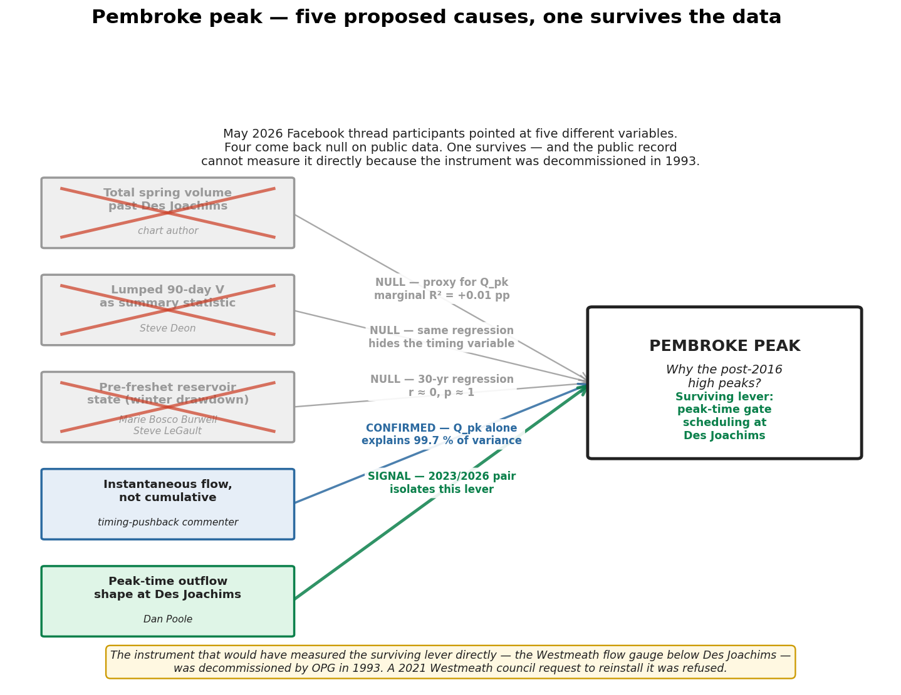

# Pembroke FB thread — synthesis of where each variable landed

**Cross-reference note — case-file index**
**Compiled: May 23, 2026**

> **Attribution note.** Participants in the May 2026 Northern Reservoirs /
> Ottawa River / Tourism / Wildlife / Flood Watch Facebook thread who
> engaged at the level of *what causes the Pembroke peak* are named here
> at the same level of public engagement they brought to the thread —
> matching the precedent set in the
> [May-22 community note](../../data/community-notes/2026-05-22_reservoir_drawdown.md)
> and the
> [May-23 Dan Poole comparison](../../data/community-notes/2026-05-23_pembroke_2023_vs_2026.md).
> The chart-author and the timing-pushback commenter are referred to by
> role only, per the
> [attribution policy](../../CONTRIBUTORS.md).

---

## Plain-language summary

The Facebook thread asked one question — *why is Pembroke peaking the
way it has since 2016?* — and five different people pointed at five
different variables. The case file has now tested each of them
independently against 30+ years of public data. Four came back null.
One came back with a signal. They converge on the same conclusion.

| Who | What they pointed at | Where it was tested | What we found |
|---|---|---|---|
| **Chart author** (role) | Total spring volume past Des Joachims | [Freshet_Volume_vs_Peakedness.md](Freshet_Volume_vs_Peakedness.md) | Volume is a **proxy** for peak flow, not a cause. Marginal R² beyond Q_pk = +0.01 pp. |
| **Steve Deon** | Total cumulative V over 90 days as a lumper-style summary | same | Same null. Lumping V over 90 d hides the timing variable that actually sets peak height. |
| **Marie Bosco Burwell / Steve LeGault** | Pre-freshet reservoir state (winter drawdown) | [Pre_Freshet_Reservoir_Scout.md](Pre_Freshet_Reservoir_Scout.md) | Null on 30 years. Top-3 peaks (2019/2017/2023) all entered freshet drawn down to 18–24 % of band. r ≈ 0, p ≈ 1. |
| **Timing-pushback commenter** (role) | Instantaneous flow, not cumulative | [Freshet_Volume_vs_Peakedness.md](Freshet_Volume_vs_Peakedness.md) | Confirmed: Q_pk alone explains 99.7 % of peak height variance. |
| **Dan Poole** | Peak-time Des Joachims outflow shape (gate operations on the day) | [2026-05-23_pembroke_2023_vs_2026.md](../../data/community-notes/2026-05-23_pembroke_2023_vs_2026.md) | **Signal.** 2023 vs 2026: same DJ peak outflow, same DJ headpond trajectory, Petawawa rose at the same rate — yet 2026 Pembroke peaked 14 cm lower and rose 3× slower. The only remaining lever is DJ outflow Q *scheduling* during the event. |

*The same table as a single image. Five variables proposed by the
thread, four eliminated with the statistic that killed them, one
surviving — flowing into the Pembroke peak. The yellow footer marks
the public-record instrument (Westmeath flow gauge, decommissioned
1993, refused for reinstall 2021) that would have measured the
surviving lever directly.*

**The convergent reading.** Four of the five variables the thread
proposed are testable on public data and come back null. The fifth —
peak-time gate scheduling at Des Joachims — is the only one that
survives, and the 2023/2026 natural experiment isolates it as
*non-null* because the other variables are controlled by construction
(same DJ peak Q, same DJ headpond pattern, same Petawawa rate-of-rise).

This is not a case of "we haven't ruled out gate operations." It is a
case of **the public record having ruled out everything else** that
could plausibly explain the Pembroke shape difference. The remaining
lever is the operator-internal one: the daily outflow schedule from
Des Joachims, which OPG holds and the Westmeath gauge — decommissioned
1993, refused for reinstall in 2021 — would have measured directly.

The thread, read across all five voices together, is not five
competing theories. It is five constraints triangulating one variable.

---

## How each variable was eliminated

### Total volume (chart author, Steve Deon)

The chart shows V (volume past DJ over the spring) and H (Pembroke
peak level) line up across years with R² ≈ 0.73, and points after 2016
sit on the same curve as before. The chart author concluded operators
are not to blame. Steve Deon argued more bluntly that V *is* the
correct lumped summary.

The companion-note regression, on Britannia 1960–2024 (59 springs):

- V alone: R² = 0.80
- Q_pk alone: R² = 0.997
- V + Q_pk: R² = 0.997
- V's marginal contribution: +0.01 pp

V correlates with Q_pk at r = 0.89. Once Q_pk is in the model, V is
statistically silent. The chart shows the *hydraulic rating curve* is
unchanged — given the water that came down, Pembroke responded as it
always has. It does not show that the *water that came down* was
operated the same way.

### Pre-freshet reservoir state (Marie Bosco Burwell, Steve LeGault)

Marie and Steve LeGault argued — separately, both in plain-language
terms — that the right variable is how full the upper-basin
reservoirs were entering the freshet. "Empty bucket vs full bucket"
was the framing.

The pre-freshet scout regression, on 30 paired April-1 observations
(1990–2024):

- Basin-wide (13 reservoirs, capacity-weighted): r = −0.117, p = 0.534
- Upper-river only (6 reservoirs, equal-weight): r = −0.009, p = 0.961

The top three peaks in the record (2019, 2017, 2023) all entered the
freshet with upper-river reservoirs drawn down to 18–24 % of band —
exactly the operating posture Marie and Steve LeGault said *should*
have produced a lower peak.

The one year with abnormally high pre-freshet storage (2012, 74 %)
produced a low peak (59.51 m). High storage and high peak are
decoupled in both directions.

### Peak-time gate operations (Dan Poole)

Dan pointed at the 2023/2026 pair as a natural experiment. Same
Des Joachims peak outflow Q (3324 m³/s by his OPG-internal numbers),
yet Pembroke peaked 14 cm lower in 2026, and Petawawa contributed
*more* water in 2026 not less.

The community-note audit:

- Pembroke peaks verify exactly: 2023 = 113.31 m, 2026 = 113.17 m
  (Δ = −14 cm)
- Petawawa peak: 399 m³/s in 2023, 479 m³/s in 2026 (Δ = +80 m³/s)
- Petawawa rate-of-rise: +44 cms/day in 2023, +41 cms/day in 2026 —
  **same**
- Des Joachims headpond pattern: drawdown to 149.5 m floor by Apr 1,
  Stage 1 refill Apr 21, plateau at 150.6 m — **same in both years**
- Pembroke rate-of-rise: +0.076 m/day in 2023, +0.026 m/day in 2026 —
  **3× difference**

With three of the four observable variables identical between years,
the only remaining lever for the 3× Pembroke shape difference is how
Des Joachims released its peak-day water across the event. Same water
budget, different schedule.

*The four observable variables in 2023 vs 2026, with the verdict
chips beneath. Three SAME, one 3× DIFFERENT. The argument is
visual: if you held three knobs constant and one knob moved, the
explanation has to lie in a fifth knob you couldn't observe. That
fifth knob is the daily outflow schedule from Des Joachims.*

---

## What this means for the case file

The case file's ask of operator-internal data has narrowed in this
direction across notes. After this thread:

1. **Pre-freshet drawdown is not the lever.** No analytical work is
   required against this variable — the public data has already
   tested it.
2. **Total spring volume is not the lever.** Same.
3. **Peak-time outflow scheduling at Des Joachims** is the lever the
   public record points at and the only one it cannot directly
   measure. The data needed is OPG's daily outflow Q at Des Joachims
   on the days surrounding the Pembroke peak — operator-internal,
   not ATIP-able under commercial-data exemption but covered by
   federal hydrometric purposes when the question is framed as a
   public-safety / land-use one.
4. **The Westmeath gauge** (downstream of DJ, decommissioned 1993,
   refused for reinstall in 2021) is the missing public instrument
   that would have made the audit direct. Its absence is now itself
   load-bearing evidence — Marie's "they don't want us to see"
   framing has a specific instrument it attaches to.

The "two questions, not one" framing from the May-22 community note —
*were the storage reservoirs drawn down?* and *was the river kept low
through winter?* — now extends to a **third**: *were the gates
operated to shave the peak during the event?* The first two are
answered. The third is the one the case file is now asking
operator-internal data to answer.

---

## Caveats

- **Britannia, not Pembroke.** The Volume-vs-Peakedness and
  Pre-Freshet Scout regressions use Britannia (02KF005) for the
  response variable because it has the long continuous public record.
  The 2023/2026 audit uses Pembroke directly. Variable-structure
  findings generalise; specific numbers do not transfer one-to-one.
- **Dan's 3324 m³/s figure is not independently audited.** It comes
  from OPG-internal numbers as relayed in the thread.
- **Five named participants, not all of them.** The thread had more
  voices than the five tracked here — these are the ones who engaged
  at the level of "what variable explains the peak." Quieter or more
  tangential comments are not tabulated.

---

## Sources

- [Volume vs Peak Flow at Pembroke](Freshet_Volume_vs_Peakedness.md)
  — chart-author and Steve Deon framings
- [Pre-Freshet Reservoir Scout](Pre_Freshet_Reservoir_Scout.md)
  — Marie Bosco Burwell and Steve LeGault framings
- [Dan Poole 2023 vs 2026 comparison](../../data/community-notes/2026-05-23_pembroke_2023_vs_2026.md)
  — Dan Poole framing
- [Reservoir drawdown community note](../../data/community-notes/2026-05-22_reservoir_drawdown.md)
  — the precedent for the named-participant attribution level used
  here and the "two questions, not one" framing this note extends to
  three
