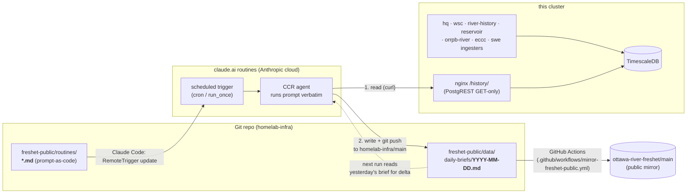

# Freshet Architecture

System-design view of the Ottawa River freshet monitoring stack.
Companion to [`README.md`](./README.md), which covers the user-facing dashboard
and data sources. This document focuses on **how the pieces fit together**:
component responsibilities, data flow, state ownership, and failure modes.

## Goals & non-goals

**Goals**

- Give a Davidson/Mansfield et Pontefract community a dashboard that's accurate, current, and
  useful during freshet — including specifically distinguishing the local
  Buckhams Bay gauge from the often-confused Britannia gauge.
- Push alerts to the property owner when the local gauge (Lac Coulonge) crosses
  configured thresholds.
- Preserve a long-term local history of river readings so the dashboard can
  show ≥7-day windows and historical context that upstream APIs don't retain.

**Non-goals**

- Replacing the official ORRPB / Vigilance / MVCA sources. The stack is
  derivative and, where they disagree, they win.
- Real-time alerting at sub-hourly resolution. The upstream APIs publish hourly;
  we don't try to be faster than the data.
- Authoritative flood forecasting. The dashboard surfaces forecasts but doesn't
  generate them.

## System diagram

```
                 Community / property owner
                          │ HTTPS
                          ▼
              ┌─────────────────────────┐
              │   freshet.xgrunt.com    │  Cloudflare Tunnel
              │   (Cloudflare edge)     │
              └───────────┬─────────────┘
                          │ → NodePort 30082 on headless-gpu
                          ▼
        ┌──────────────────────────────────────┐
        │ k3s/apps  freshet-dashboard          │
        │ ┌────────────────────────────────┐   │
        │ │ nginx                          │   │
        │ │  ┌──────┐  ┌─────────────────┐ │   │
        │ │  │ /    │  │ /history/  ─────┼─┼───┼─► PostgREST → TimescaleDB
        │ │  │ HTML │  │ (GET-only proxy)│ │   │
        │ │  └──────┘  └─────────────────┘ │   │
        │ └────────────────────────────────┘   │
        └──────────────────────────────────────┘
                          ▲              ▲
                          │ browser fetch│ browser fetch
                          │              │
        ┌─────────────────┴──┐   ┌───────┴──────────┐
        │ Vigilance Crues    │   │ open-meteo       │
        │ (QC MSP, Quebec    │   │ (basin weather + │
        │ stations + ECCC    │   │  freeze tracker) │
        │ mirrors)           │   └──────────────────┘
        └────────────────────┘
                          │
                          │  client-side fetch (CORS allowed)
                          ▼  also from the browser:
                    MVCA / Kisters KiWIS
                    (Buckhams Bay gauge)


k3s/apps  freshet-alerter (CronJob, hourly :15)
   │ poll Vigilance for station 1195
   │ compare against THRESHOLDS table
   ▼ (POST when crossed)
ntfy → freshet-mansfield topic → property owner's phone


k3s/data  river-history-ingest (CronJob, hourly :12)
   │ poll Vigilance for 18 stations (main stem + Gatineau + Lièvre cascade)
   │ poll KiWIS for Buckhams Bay
   │ poll open-meteo for 6 basin weather stations
   ▼ (upsert)
TimescaleDB hypertables: river_readings, weather_observations, river_stations


k3s/data  reservoir-ingest (CronJob, daily 21:30 UTC)
   │ scrape ottawariver.ca/conditions
   ▼ (upsert)
TimescaleDB hypertable: reservoir_readings


k3s/data  hq-ingest (CronJob, hourly :27)
   │ pull Hydro-Québec open-data feeds (centrale releases + station levels)
   │ via Cloudflare Worker relay (hq-feed-relay.aachten.workers.dev)
   │   ├─ relay stale?  retry relay ?nocache=1
   │   └─ still stale?  GitHub-Actions mirror (independent egress)
   │ filter to Ottawa basin (lat 45-48, lon -80 to -74)
   ▼ (upsert)
TimescaleDB hypertables: dam_releases, dam_inflows, dam_levels, dam_sites


Cloudflare Worker  hq-feed-relay  (cloudflare/hq-feed-relay/)
   │ path-pinned proxy for the two HQ feeds; egresses from Cloudflare,
   │ which HQ serves fresh (the cluster IP gets a frozen cached copy)
   ▼
GitHub Actions  mirror-hq-feeds.yml (hourly :17)
   │ fetch HQ feeds from a GitHub runner (independent egress)
   ▼ publish as release assets → hq-ingest fallback URLs


k3s/data  wsc-ingest (CronJob, hourly :37)
   │ pull WSC realtime CSV (level + discharge)
   │ for active basin gauges (Britannia, Mattawa, Mississippi, Rideau, ...)
   ▼ (upsert)
TimescaleDB hypertable: wsc_readings


k3s/data  orrpb-river-ingest (CronJob, daily 21:40 UTC)
   │ scrape ottawariver.ca/conditions ?display=river (Average Daily Flows)
   │ main-stem OPG dams not in the HQ feed (Otto Holden, Des Joachims, ...)
   ▼ (upsert)
TimescaleDB hypertable: orrpb_river_flows


k3s/data  eccc-ingest (CronJob, every 6h :47)
   │ pull ECCC daily climate bulk CSV
   │ for 9 watershed climate stations (Maniwaki, Témiscamingue, Val-d'Or, ...)
   ▼ (upsert)
TimescaleDB hypertable: eccc_climate_daily


k3s/data  swe-caldas-ingest (CronJob, daily)   swe-era5-ingest (CronJob, daily)
   │ ECCC GeoMet CaLDAS-NSRPS (current)         │ Copernicus ERA5-Land (1950→)
   ▼ (upsert)                                   ▼ (upsert)
TimescaleDB hypertables: swe_daily, swe_locations
```

## Components

### Browser (the dashboard)

The dashboard is a **single-page static HTML application** served by nginx
([`index.html`](../k3s/base/apps/files/freshet-dashboard/index.html)). It does
its own fetching client-side and renders with Chart.js + Leaflet. Three classes
of data source:

1. **Vigilance Crues** for Quebec stations (and ECCC-mirrored Ontario stations
   like Mattawa). The shape is `{metadata, readings}` with `valeurs_niv` for
   the rolling ~72-hour buffer.
2. **MVCA Kisters KiWIS** for Buckhams Bay (`fetchKiwisStation()`). The
   adapter returns the same `{metadata, readings}` shape so all renderers
   work unchanged.
3. **PostgREST via the in-house `/history/` proxy** for >72-hour windows. Only
   used when the user selects a 7-day chart.

The dashboard uses **synthetic integer station IDs** (`>=99000`) for non-Vigilance
sources. The IDs only need to be unique within the dashboard's namespace.
99001 = Buckhams Bay (MVCA).

### Alerter (k3s/apps · `freshet-alerter`)

Hourly Python CronJob. Polls Vigilance for station 1195 (Lac Coulonge),
compares the latest reading against a hardcoded threshold table, POSTs to ntfy
on crossing. Stateless — no de-duplication. Alerts are intentionally noisy at
threshold boundaries; rely on the user to dismiss.

Runtime: stdlib-only Python in a `python:3.12-alpine` image. Script delivered
via configMapGenerator so editing the script auto-rolls the next CronJob.

### River-history ingester (k3s/data · `river-history-ingest`)

Hourly Python CronJob. Three responsibilities in one script:

1. Poll Vigilance for 18 stations (main stem + Gatineau cascade 442/994/982/983 + Lièvre cascade 522/196/211/300) → write `river_readings`.
2. Poll MVCA KiWIS for configured stations (currently just Buckhams Bay) →
   write `river_readings` with synthetic IDs ≥99000.
3. Poll open-meteo for 6 basin weather stations → write `weather_observations`.

The init container reruns `bootstrap.sql` on every invocation. The SQL is
idempotent (`CREATE TABLE IF NOT EXISTS`, `SELECT create_hypertable(... if_not_exists => TRUE)`)
so schema changes roll forward without fighting Job immutability.

Lookback is configurable per source (`MVCA_LOOKBACK_HOURS` env var, default 24).
For backfill, run a one-off Job with the lookback set to thousands of hours;
the `Prefer: resolution=ignore-duplicates` POST header makes overlap safe.

### Reservoir ingester (k3s/data · `reservoir-ingest`)

Daily Python CronJob (21:30 UTC, after ORRPB's mid-afternoon-Eastern refresh).
Scrapes the 8-day rolling reservoir-conditions table from
`ottawariver.ca/conditions`, parses with stdlib `html.parser`, upserts into
`reservoir_readings`. Same configMapGenerator + init-container schema-bootstrap
pattern as the river ingester.

### Hydro-Québec ingester (k3s/data · `hq-ingest`)

Hourly Python CronJob (`:27`). Pulls two HQ open-data JSON feeds linked from
`hydroquebec.com/production/debits-niveaux-eau.html`:

1. **Centrale release telemetry** (~3 MB) — hourly turbined / spilled / total
   m³/s + daily filtered local inflow per generating station. Writes to
   `dam_releases` (wide: total/turbined/spilled per `(site_id, time)`) and
   `dam_inflows` (daily incremental).
2. **Station levels** (~15 MB; misnamed "TARAGES") — hourly water-level
   readings at the gauging-station network. Writes to `dam_levels`.

Filters both to the Ottawa basin window (lat 45–48, lon -80 to -74) so the
ingester targets ~21 centrales + ~77 level stations rather than the entire
Quebec hydro fleet. Each pull contains ~10 days of hourly data.

Site metadata is upserted (`merge-duplicates`); time-series data is
`ignore-duplicates`.

**Feed relay & fallback chain.** The ingester does *not* fetch
`hydroquebec.com` directly. The cluster's egress IP gets adverse treatment
from HQ's edge — intermittent `SSLV3_ALERT_HANDSHAKE_FAILURE`, and when a
connection does succeed, a **stale cached copy** of the JSON (the original
`SECLEVEL=1` cipher workaround was no longer sufficient). The ingester now
walks a three-tier chain:

1. **Cloudflare Worker relay** — `hq-feed-relay.aachten.workers.dev`
   ([`cloudflare/hq-feed-relay/`](../../cloudflare/hq-feed-relay/)), a
   path-pinned proxy deployed with `wrangler`. It egresses from Cloudflare,
   which HQ serves the fresh feed. 15-minute edge cache.
2. **Relay with `?nocache=1`** — if the relayed feed looks frozen, retry
   skipping the Worker's edge cache *and* appending a unique query string so
   HQ's own CDN can't serve a stale object either.
3. **GitHub-Actions mirror** — if every relay path is still stale (HQ has
   degraded the Cloudflare colo too), fall back to release assets published
   hourly by [`mirror-hq-feeds.yml`](../../.github/workflows/mirror-hq-feeds.yml),
   which fetches the feeds from a GitHub runner on independent, rotating
   egress.

A feed is judged "stale" when its newest timestamp is older than a freshness
threshold. If all paths fail, the ingester posts a **one-shot** ntfy alert —
fired only on the transition into (and out of) the stale state, not every
run. URLs and the ntfy target are env vars on
[`k3s/base/data/hq-ingest.yml`](../../k3s/base/data/hq-ingest.yml).

### ORRPB river-flows ingester (k3s/data · `orrpb-river-ingest`)

Daily Python CronJob (21:40 UTC, offset from `reservoir-ingest`). Scrapes the
`?display=river` "Average Daily Flows (m³/s)" table from
`ottawariver.ca/conditions` — main-stem Ottawa River discharge at Temiscaming,
Otto Holden, Des Joachims, Chenaux, Chats Falls, Britannia and Carillon
(8-day rolling window), upserting into `orrpb_river_flows`. This is the **only
public source** for the OPG main-stem dams (Otto Holden, Des Joachims,
Chenaux, Chats Falls), which are absent from the HQ open-data feed. Same
configMapGenerator + init-container bootstrap pattern as the other ingesters.

### SWE ingesters (k3s/data · `swe-caldas-ingest`, `swe-era5-ingest`)

Two daily Python CronJobs that populate snow-water-equivalent history,
joinable against the flow/level tables:

- **`swe-caldas-ingest`** — samples ECCC GeoMet's CaLDAS-NSRPS 2.5 km
  operational analysis by WMS `GetFeatureInfo` at named basin points. No
  auth. GeoMet serves only the *current* analysis, so this feed accumulates
  forward from when the ingester starts.
- **`swe-era5-ingest`** — pulls Copernicus ERA5-Land
  (`snow_depth_water_equivalent`) via the CDS API for the deep history back
  to **1950**. Requires a CDS Personal Access Token (`CDS_API_KEY`) and the
  `cdsapi` + `netCDF4` libraries; supports a resumable one-shot 1950→present
  backfill.

Both write to `swe_daily` (discriminated by `source`); `swe_locations` holds
the sampled-point / sub-basin metadata.

### WSC realtime ingester (k3s/data · `wsc-ingest`)

Hourly Python CronJob (`:37`). Pulls the WSC realtime CSV inline endpoint for
configured station codes (`02KF005` Britannia, `02JE013` Mattawa, etc.) — both
**level** (parameter 46) and **discharge** (parameter 47), 5-minute cadence,
24-hour lookback. Writes to `wsc_readings` keyed by `(station_code, time)`.

Why complementary to Vigilance: Vigilance often publishes only level. WSC
publishes both for the same gauges, plus stations Vigilance doesn't carry.

### ECCC daily climate ingester (k3s/data · `eccc-ingest`)

Six-hourly Python CronJob (`47 */6 * * *`). Pulls daily climate bulk CSV from
`climate.weather.gc.ca/climate_data/bulk_data_e.html` for 9 watershed stations
(Ottawa CDA, Maniwaki, Barrage Témiscamingue, Mont-Laurier, Parent, Val-d'Or,
Rouyn, North Bay, Pembroke). Writes to `eccc_climate_daily`. Used for the
climate-residual analysis in Exhibit E and the step-change watershed test.

### TimescaleDB + PostgREST (k3s/data)

TimescaleDB is the **only durable state** in the stack. Hypertables:

| Table | Key | Source | Cadence |
|---|---|---|---|
| `river_readings` | `(station_id, time)` | Vigilance + MVCA KiWIS | hourly |
| `weather_observations` | `(station, time)` | open-meteo | hourly |
| `reservoir_readings` | `(reservoir_id, time)` | ORRPB scrape | daily |
| `dam_releases` | `(site_id, time)` | HQ open-data centrales | hourly |
| `dam_inflows` | `(site_id, time)` | HQ open-data centrales | daily |
| `dam_levels` | `(station_id, time)` | HQ open-data stations | hourly |
| `wsc_readings` | `(station_code, time)` | WSC realtime CSV | 5-min |
| `orrpb_river_flows` | `(station, date)` | ORRPB river-flows scrape | daily |
| `eccc_climate_daily` | `(station_id, time)` | ECCC bulk CSV | daily |
| `swe_daily` | `(location, source, date)` | CaLDAS-NSRPS + ERA5-Land | daily |

`river_stations` (provider-tagged), `dam_sites` (centrales + stations
metadata) and `swe_locations` (sampled-point / sub-basin metadata) are
regular tables for upsert-on-change semantics.

PostgREST sits in front of the DB and exposes a JSON API. The dashboard's nginx
proxies `/history/*` to PostgREST with **GET/HEAD/OPTIONS only** ([nginx.conf:24-30](../k3s/base/apps/files/freshet-dashboard/nginx.conf#L24-L30))
so browsers can read but not mutate. This is also the path remote agents use
for cluster-state visibility (the route is exposed via Cloudflare; no auth).

### Scheduled remote agents (routines)

The stack also includes **scheduled remote Claude Code agents** that produce
markdown artifacts on a schedule — currently a daily basin-state brief and a
deployment-anniversary health check. Their prompts live in
[`freshet-public/routines/`](../routines/) as version-controlled `.md` files
(see [`routines/README.md`](../routines/README.md) for the full convention).
The agents themselves run in Anthropic's cloud (CCR sandbox) but treat this
cluster as their canonical data source via the same `/history/` proxy the
dashboard uses.



Two design choices worth calling out:

- **Proxy-first, upstream-fallback.** Routines fetch from the cluster
  PostgREST proxy as the canonical source, not from `hydroquebec.com` /
  `vigilance` / etc. The cluster ingesters already handle the upstream TLS
  quirks (notably HQ's `SECLEVEL=1` requirement) and rate limits, and serve
  clean JSON that the agent can consume without TLS handshake or User-Agent
  contortions. Direct upstream fetches are fallback-only, used when the
  proxy itself returns a non-2xx.
- **Verify before declaring an outage.** Routine prompts include a guardrail
  forbidding "API down" / "503" / "unreachable" language unless preceded by
  an independent `curl` probe whose observed HTTP code is included alongside
  the claim. This was added after a 2026-05-05 brief falsely reported a
  three-day HQ outage while the API and the cluster ingester were both
  healthy throughout — the agent had simply mishandled an early fetch error
  and didn't verify before generalising it.

The routine writes its artifact via `git push origin main` and stops there.
Mirroring to the public repo is handled by a GitHub Actions workflow
([`.github/workflows/mirror-freshet-public.yml`](../../.github/workflows/mirror-freshet-public.yml))
that fires on any push to `main` touching `freshet-public/**` and runs
`git subtree push` in GitHub's auth context using a fine-grained PAT
(repo secret `MIRROR_PAT`, scoped `Contents: write` on
`ottawa-river-freshet`). This was previously attempted from inside the
routine and reliably failed — the CCR sandbox has no GitHub credentials
for the secondary remote. Moving the push to CI gives it stable auth and
keeps the routine focused on the brief itself.

A `scripts/sync-freshet-public.sh` helper still exists for one-off
manual syncs (e.g. when the workflow is disabled or the PAT is rotating)
but is no longer the canonical path.

## Data flow

### Read path: dashboard load

```
1. Browser → CDN (Cloudflare) → freshet-dashboard nginx → static index.html
2. JS runs renderAll():
   a. fetchPrimary() → Vigilance × 4 stations (1195, 1004, 1279, 545)
   b. fetchRegional() → 8 stations, dispatching by source:
      - 7 Vigilance (parallel)
      - 1 MVCA KiWIS (Buckhams Bay)
   c. fetchWeather() → open-meteo, 6 locations in one bulk call
   d. fetchSeasonPeak() → /history/river_readings (PostgREST) for 1195
3. If user selects >72h window: fetchStationHistory() → /history/river_readings
4. If user opens Map: leaflet lazy-loaded, MAP_STATIONS rendered using
   already-cached lastData (or refetched per-station as needed)
```

Browser caches: none enforced beyond Chart.js / Leaflet bundles. Each load
is fresh.

### Write path: ingest

```
1. CronJob fires (hourly :12 for river, daily 21:30 for reservoirs)
2. Init container runs bootstrap.sql via psql (idempotent)
3. Main container script:
   a. Vigilance loop → POST /river_readings (PostgREST)
   b. MVCA loop      → POST /river_readings (synthetic IDs)
   c. open-meteo     → POST /weather_observations
   d. (reservoir job): scrape → POST /reservoir_readings
4. Each POST uses Prefer: resolution=ignore-duplicates to make replays safe
5. ttlSecondsAfterFinished cleans up the Job pod after 1h (24h for reservoirs)
```

### Alert path

```
1. CronJob fires hourly at :15 (after Vigilance's :05-:10 publish + buffer)
2. Script fetches Vigilance for station 1195
3. Compares latest reading to hardcoded THRESHOLDS table
4. On crossing: POST to ntfy → push to subscribed clients
5. No state, no de-duplication
```

## State ownership

Everything that survives a pod restart is in **TimescaleDB** (a StatefulSet
with a PVC on `headless-gpu`). All other components are stateless:

- Dashboard: static HTML + JS, nothing persists between page loads.
- Alerter: stateless; replaying the same threshold-crossing alert is acceptable
  cost.
- Ingesters: stateless; lookback windows always overlap previous runs and
  duplicate inserts are ignored.

The TimescaleDB PVC is the **single point of recovery concern**. Backups are
out of scope for this doc but the data is reconstructable: Vigilance and MVCA
both serve full history on demand, and a backfill Job can rebuild
`river_readings` from scratch if needed (~35k rows for Buckhams Bay alone,
~hundreds of thousands across all stations).

## External dependencies

| Dependency | Used by | Criticality | Failure behaviour |
|---|---|---|---|
| Vigilance Crues (QC MSP) | Dashboard, alerter, ingester | Hard — drives 7 of 8 regional stations + property gauge | Dashboard shows skeleton/error; alerter logs and exits 0; ingester logs partial success |
| open-meteo | Dashboard freeze tracker | Soft — ancillary forecast info | Freeze tracker hides; rest of dashboard unaffected |
| MVCA Kisters KiWIS | Dashboard (Buckhams Bay), ingester | Soft — one regional card, doesn't gate property alerts | Buckhams Bay card shows "Unavailable"; rest of corridor unchanged |
| ORRPB conditions page | Reservoir + orrpb-river ingesters | Soft — reservoir/flow context, not real-time | Daily scrape jobs log and exit 0; stale data persists |
| Hydro-Québec open-data | hq-ingest → Operations tab + dam forecasts | Hard for the Operations tab | hq-ingest walks the relay → `?nocache=1` → GitHub-mirror fallback chain; one-shot ntfy alert if all stale |
| hq-feed-relay (Cloudflare Worker) | hq-ingest (primary HQ path) | Soft — degrades to the GitHub mirror | Ingester falls through to `HQ_*_FALLBACK_URL` |
| GitHub-Actions HQ mirror | hq-ingest (last-resort HQ path) | Soft — only used when relay is stale | If it too is stale, ingester posts the one-shot ntfy alert and exits |
| ECCC GeoMet / Copernicus CDS | SWE ingesters | Soft — analysis history, not real-time | Daily jobs log and exit; CDS needs `CDS_API_KEY` or fails loudly |
| ntfy | Alerter, hq-ingest stale alert | Hard for alerts only | Alerter logs and exits 1 (no fallback channel) |
| Cloudflare tunnel | Public dashboard access | Hard for external users | Local NodePort still works for in-network access |

## Failure modes

**Vigilance silence.** If Vigilance stops publishing (rare but happens —
seasonal maintenance, infra issues), the alerter is silent (no crossings
detected) and the ingester writes no new rows. The dashboard's regional cards
fail individually but the layout stays intact. There's currently no monitoring
that flags this; a remote agent or Prometheus rule could close that gap.

**MVCA endpoint changes.** KiWIS exposes ts_ids that, in principle, could be
re-numbered if MVCA migrates platforms. The dashboard would show "Unavailable"
on the Buckhams Bay card; the ingester would log fetch failures but keep
running for Vigilance. The configured ts_id (`48242042`) is in
`MVCA_STATIONS` env var — single point of update.

**Schema drift between dashboard and DB.** The dashboard's `fetchStationHistory`
maps `{time, level_m}` from PostgREST → `{date_prise_valeur, valeur}` shape.
If the bootstrap SQL ever changed those column names, the merge would silently
return wrong data. The init-container pattern means schema is always whatever
the latest `bootstrap.sql` says.

**TimescaleDB outage.** Dashboard 7-day window fails (PostgREST returns
errors); 72h-and-under continues working from Vigilance directly. Ingester
fails closed (Job retries); no data loss because Vigilance retains its 72h
buffer and the next successful Job catches up.

**Ingester drift / silent failure.** The cron runs hourly but if the pod
crashes consistently, hours of data go uningested. Recovery: bump
`MVCA_LOOKBACK_HOURS` (or the equivalent for Vigilance) for one run. The
upstream APIs hold enough history to backfill multiple weeks.

## Deployment topology

Single-cluster k3s, two namespaces:

- **`apps`** — user-facing components: `freshet-dashboard` (Deployment + Service +
  external NodePort), `freshet-alerter` (CronJob).
- **`data`** — durable storage and ingesters: TimescaleDB (StatefulSet),
  PostgREST (Deployment), and the CronJob ingesters `river-history-ingest`,
  `reservoir-ingest`, `hq-ingest`, `wsc-ingest`, `orrpb-river-ingest`,
  `eccc-ingest`, `swe-caldas-ingest`, `swe-era5-ingest`.

`headless-gpu` is the node with the PVC for TimescaleDB; node affinity in the
StatefulSet pins it there. Other workloads schedule freely.

**Off-cluster components.** Two pieces of the stack live outside k3s and are
deployed independently:

- **`hq-feed-relay`** — a Cloudflare Worker
  ([`cloudflare/hq-feed-relay/`](../../cloudflare/hq-feed-relay/)) deployed
  with `npx wrangler deploy` against the owner's Cloudflare account. It has no
  cluster footprint; `hq-ingest` reaches it over the public internet. Changing
  it means editing `worker.js` / `wrangler.toml` and redeploying — it is not
  managed by Kustomize.
- **GitHub Actions workflows** — `mirror-hq-feeds.yml` (hourly HQ-feed mirror)
  and `mirror-freshet-public.yml` (public-repo mirror) run in GitHub's
  infrastructure, not the cluster.

ConfigMapGenerator delivers all script files (HTML, Python, SQL) to their
Deployments / CronJobs. Hash-suffixed ConfigMap names mean editing a script
auto-rolls the consuming workload — no manual restart needed.

## Integration points & extension

**Adding a new gauge.** Two cases:

1. *Vigilance station.* Add the integer ID to `STATION_IDS` in the
   river-history-ingest env, add an entry to `REGIONAL_STATIONS` in the
   dashboard's `index.html`, optionally add to `MAP_STATIONS`,
   `CORRIDOR_BAR_STATIONS`, `STATIONS_TAB_IDS`. Ingester picks it up on next
   run.
2. *Non-Vigilance source (KiWIS, custom sensor, etc.).* Pick a synthetic
   integer ID ≥99000. Write a new fetch adapter that returns the
   `{metadata, readings}` shape (see `fetchKiwisStation` for the template).
   Add to `REGIONAL_STATIONS` with a `source` discriminator and any
   adapter-specific fields. Update the dispatch in `fetchRegional()` and the
   map fallback. Optional: extend `ingest.py` with the same source so the DB
   captures long-term history.

**Adding a new threshold alert.** Edit the `THRESHOLDS` table in
[`alerter.py`](../k3s/base/apps/files/freshet-alerter/alerter.py). The cron
auto-rolls on configmap change.

**Adding a new external sink.** The alerter only POSTs to ntfy; adding e.g. a
Discord webhook is a few lines + a secret reference. Keep both behind the same
threshold-crossing logic so notifications stay aligned.

## What's deliberately not here

- **Email / SMS alerts.** ntfy push is sufficient for the property owner; SMS
  was considered and skipped on cost.
- **A second physical gauge on the property.** Stubbed in
  [`sensor-bom.md`](./sensor-bom.md) but not built. If added, write to
  `river_readings` with a station ID like 9001 and add a card to the
  dashboard — no schema or ingest changes required.
- **Automated freshet-peak forecasting.** The dashboard surfaces ORRPB
  forecasts but doesn't model them. The historical CSV
  ([`data/orrpb-historic-peaks-1972-2025.csv`](./data/orrpb-historic-peaks-1972-2025.csv))
  feeds the dashboard's percentile-context chips but isn't used for
  prediction.
- **Authentication / authorization.** Dashboard is fully public via
  Cloudflare; PostgREST proxy is GET-only. No write paths are exposed
  externally. Adding auth would be straightforward (Cloudflare Access on the
  hostname) but currently unnecessary.
