# Routines

This directory holds the source-of-truth definitions for the **scheduled remote
Claude Code agents** ("routines") that contribute to the freshet-monitoring
project. Each `.md` file in this directory is one routine: its metadata
(schedule, environment, sources, connectors) and its full prompt, version
controlled alongside the rest of the stack.

## Why prompt-as-code

Routines are stored on Anthropic's claude.ai infrastructure and edited through
the web UI or the `RemoteTrigger` API. That is convenient but invisible — there
is no diff history, no review surface, and a small prompt change can quietly
shift the daily output. A routine that runs every day for months will outlive
any Slack conversation that explained why it does what it does.

Treating the prompt as code in this repo gives us:

- **Auditability** — every change is a normal `git` diff. Why a guardrail was
  added is in the commit message and PR description.
- **Reduced ambiguity for future LLMs** — when the daily-brief agent itself,
  or a maintainer using Claude Code, reads the routine, it sees the prompt
  exactly as it runs. No reverse-engineering from output. The 2026-05-05 brief
  failure (false "HQ API down" claim) was directly caused by ambiguity in the
  prior prompt; the fix lives in this directory.
- **One source of truth** — when the live routine drifts from the file, the
  file wins. We re-push from file to API, not the other way around.

## How a routine flows, end to end

```mermaid
flowchart LR
    subgraph dev["Developer workflow"]
        direction TB
        file["routines/*.md<br/><i>prompt-as-code</i>"]
        commit["git commit + push<br/>→ homelab-infra"]
        push["Claude Code:<br/>RemoteTrigger update<br/><i>(file → API)</i>"]
        file --> commit --> push
    end

    subgraph cloud["claude.ai (Anthropic cloud)"]
        direction TB
        live["live routine<br/>(cron or run_once_at)"]
        agent["CCR sandbox agent<br/>runs the prompt verbatim"]
        live -- "schedule fires" --> agent
    end

    subgraph homelab["Homelab k3s cluster"]
        direction TB
        proxy["freshet.xgrunt.com/history/<br/>PostgREST proxy<br/><i>GET-only, no auth</i>"]
        db[("TimescaleDB<br/>(dam_*, river_*, wsc_*, ...)")]
        ingest["Hourly ingesters<br/>hq · wsc · vigilance · mvca"]
        ingest -- "hourly upserts" --> db
        proxy --> db
    end

    subgraph artifacts["Output artifacts"]
        direction TB
        brief["data/daily-briefs/<br/>YYYY-MM-DD.md"]
        homelabrepo["homelab-infra/main"]
        gha["GitHub Actions:<br/>mirror-freshet-public"]
        public["ottawa-river-freshet/main<br/><i>(public mirror)</i>"]
        brief -- "git push" --> homelabrepo
        homelabrepo -- "push event<br/>(freshet-public/**)" --> gha
        gha -- "git subtree push<br/>(PAT auth)" --> public
    end

    push --> live
    agent -- "1. read (curl)" --> proxy
    agent -- "2. write" --> brief

    classDef src fill:#e8f0ff,stroke:#5b8def
    classDef cloud fill:#fff4e6,stroke:#e89b3c
    classDef cluster fill:#e8f7e8,stroke:#4a9a4a
    classDef out fill:#f7e8f7,stroke:#a64ca6
    class file,commit,push src
    class live,agent cloud
    class proxy,db,ingest cluster
    class brief,homelabrepo,public out
```



The arrows on the left are the **edit lifecycle** (file authored locally,
pushed to claude.ai). The arrows on the right are the **run lifecycle** (each
scheduled fire reads from the cluster proxy, writes a markdown artifact,
publishes back to the repo, and a GitHub Actions workflow auto-mirrors the
public-facing subdirectory to `ottawa-river-freshet`). Output artifacts feed
back into the same git repo whose `routines/` directory holds the prompt —
closing the loop. Routines themselves never touch the public mirror; they
only push to `homelab-infra` and let CI handle the rest.

## Layout

Each routine is one self-contained markdown file:

```
freshet-public/routines/
├── README.md                       # this file
├── freshet-daily-brief.md          # daily 11:00 UTC brief generator
└── ...                             # additional routines as they are added
```

Front-matter at the top of each routine file holds the structured metadata:

```yaml
---
trigger_id: trig_01...              # claude.ai routine ID (stable, do not change)
name: freshet-daily-brief           # display name (matches API)
schedule: "0 11 * * *"              # cron in UTC, OR run_once_at: ISO timestamp
environment: env_015...             # CCR environment ID (anthropic_cloud)
model: claude-sonnet-4-6            # default for all freshet routines
sources:                            # git checkouts available to the agent
  - https://github.com/aachtenberg/homelab-infra
  - https://github.com/aachtenberg/ottawa-river-freshet
allowed_tools:                      # Claude Code tools the agent may call
  - Bash
  - Read
  - Write
  - Edit
  - Glob
  - Grep
mcp_connections: []                 # MCP connectors attached to the routine
---
```

The body of the file, after the front-matter, is the **verbatim prompt** that
the routine runs. Section headings inside the prompt (e.g. `## Project
context`, `## Operating instructions`) are the agent's instructions, not
documentation about the agent — they go straight to the model.

## Editing a routine

1. **Edit the file in this directory.** Treat it as the canonical version.
2. **Commit and review.** A routine change is a real change; it deserves a
   commit message that explains why, and ideally a PR if the change is
   non-trivial (anything beyond fixing a typo).
3. **Push to claude.ai.** From a Claude Code session, ask Claude to update the
   routine using the `RemoteTrigger` tool: pass `action: "update"`, the
   `trigger_id` from the front-matter, and the new prompt. Claude can also
   regenerate the `events[].data.uuid` (must be a fresh lowercase v4 UUID per
   update).
4. **Verify.** After the next scheduled run, read the routine's output (for
   the daily brief, that's `freshet-public/data/daily-briefs/YYYY-MM-DD.md`)
   and confirm the new prompt produced what you expected.

There is currently no automated sync from this directory to the claude.ai
routine API — updates are triggered manually through Claude Code. If we add
more than a handful of routines here, that automation is worth building.

## Listing routines from Claude Code

To see the live state of routines (including ones not yet documented here),
ask Claude Code to run `RemoteTrigger` with `action: "list"`, or visit
[https://claude.ai/code/routines](https://claude.ai/code/routines).

## Adding a new routine

1. Create a new `.md` file in this directory (use kebab-case matching the
   routine `name`).
2. Fill in the front-matter — at minimum `trigger_id` (after creation),
   `name`, `schedule`, `environment`, `sources`, and `allowed_tools`.
3. Write the prompt body. Keep prompts self-contained: the agent boots with
   no conversation context, so anything the agent needs to know must be in
   the prompt or discoverable from the source repos.
4. Create the routine on claude.ai via `RemoteTrigger` `action: "create"`,
   then paste the returned `trigger_id` back into the front-matter and commit.

## Conventions

- **UTC everywhere.** Cron schedules and `run_once_at` timestamps are UTC.
  Briefs use UTC dates. The user's local timezone is also UTC, so this is
  the natural choice — no conversion needed.
- **Prefer the cluster PostgREST proxy** (`https://freshet.xgrunt.com/history/`)
  over fetching upstream APIs directly. The proxy is no-auth, returns clean
  JSON, and is fed by in-cluster ingesters that handle TLS quirks and rate
  limits. Direct upstream fetches are fallbacks only.
- **Verify before declaring an outage.** If a routine is about to write
  "API down" / "503" / "unreachable" / similar, it must first run an
  independent `curl` probe and include the observed HTTP code. A single
  failed fetch in the agent's tooling is not evidence of an outage. (See
  the daily-brief prompt for the canonical phrasing of this guardrail.)
- **Every routine should be idempotent.** Re-running it should produce the
  same artifact, or a clearly-versioned new one. Don't depend on global
  state outside the source repos and the public APIs the prompt names.
